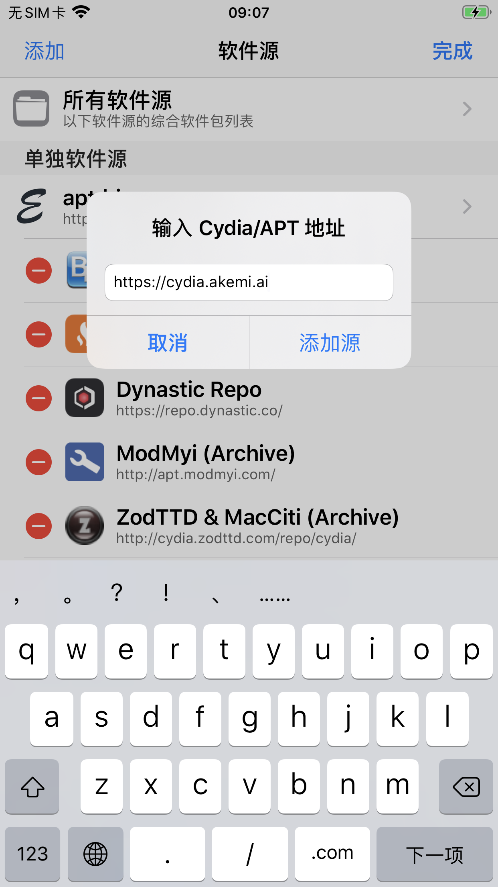
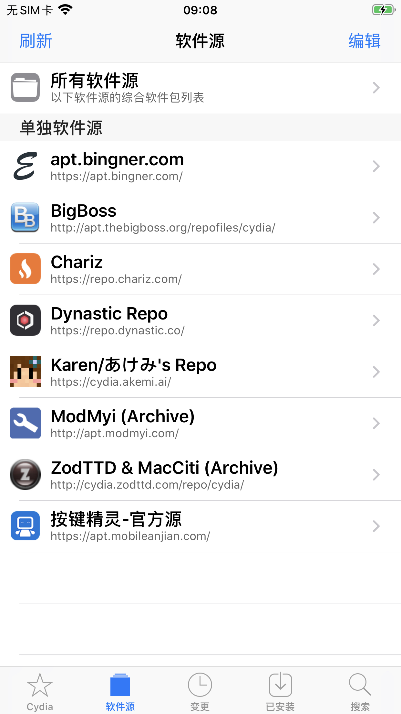
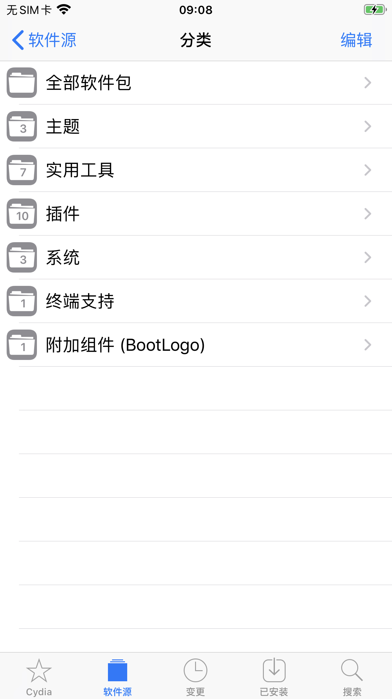
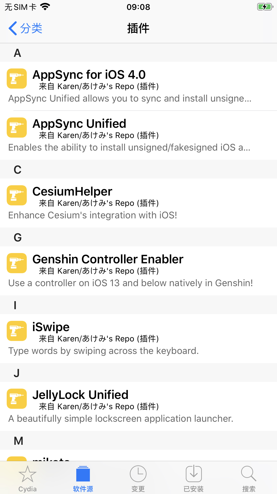
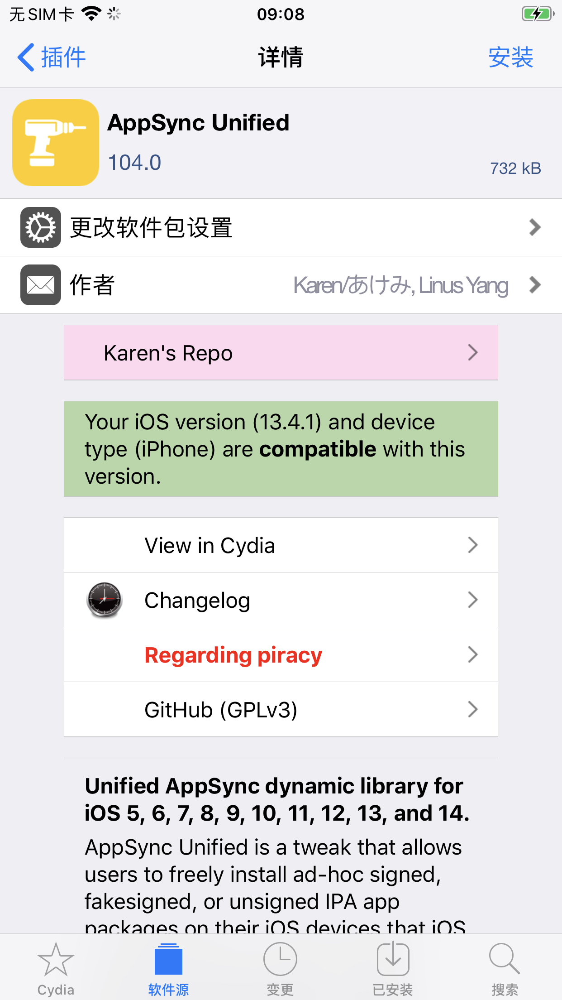
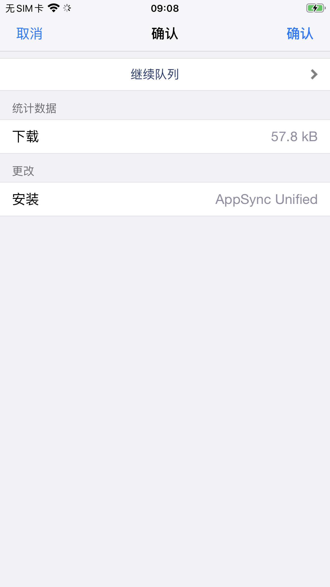
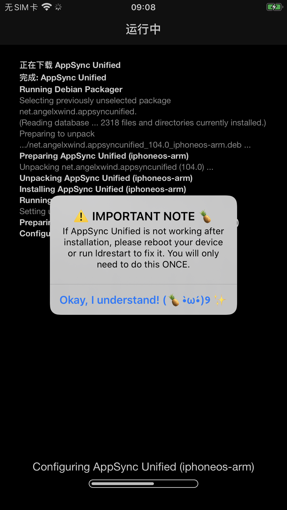
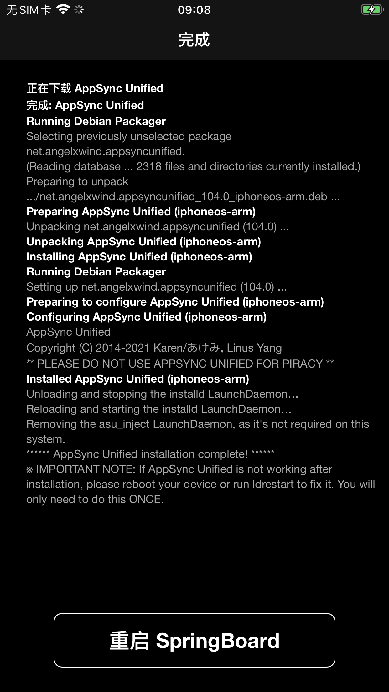
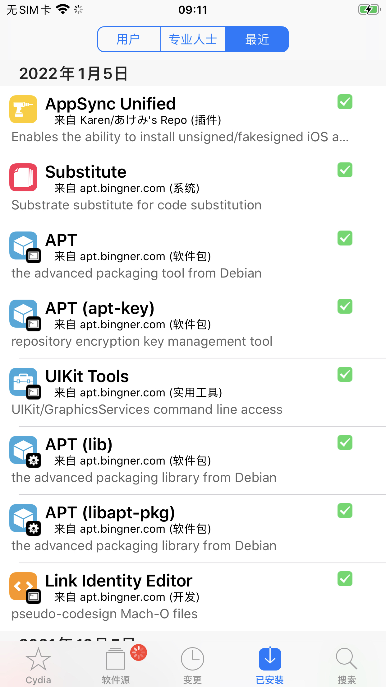

# Cydia安装

此处以`iPhone7 Plus`为例，举例介绍AppSync Unified安装的详细过程：

Cydia中输入源地址：

https://cydia.akemi.ai/

看到对应的源了：

`Karen/あけみ’s Repo`

点击进去，看到有各种插件：

点击`插件`，进入：

进入：

点击`安装`，进入`确认`页面：

开始安装过程：

安装完成，重启SpringBoard：

重启后，从Cydia中可以看到，最近安装的插件中，有了：

`AppSync Unified`

