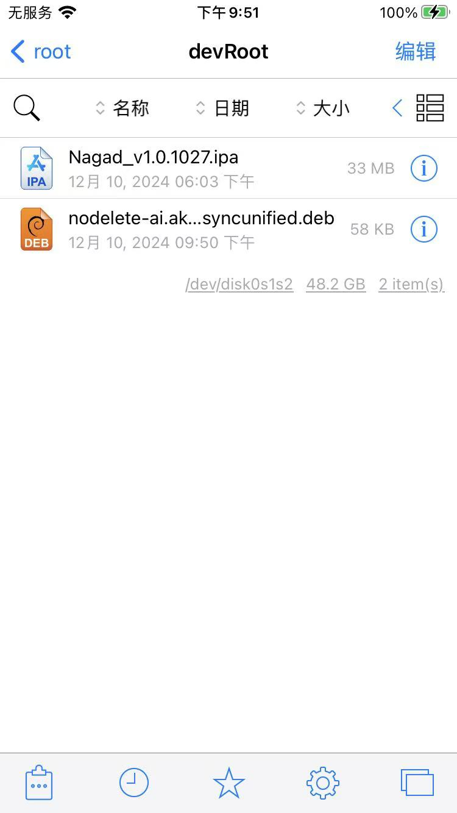
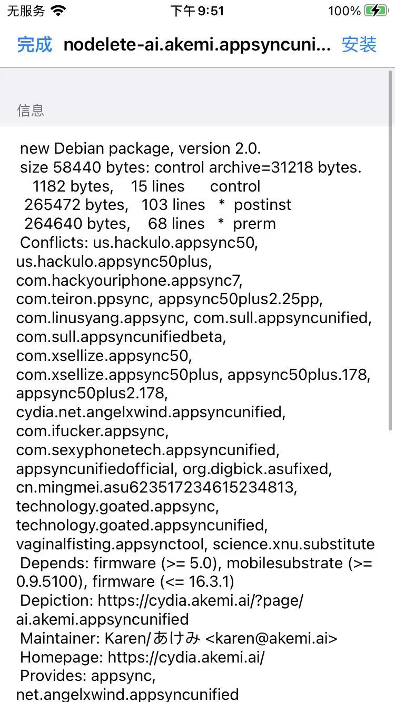
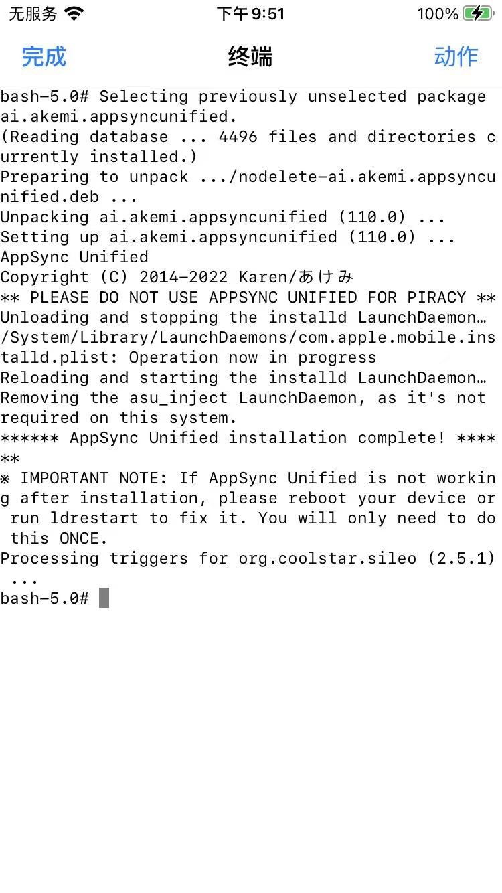
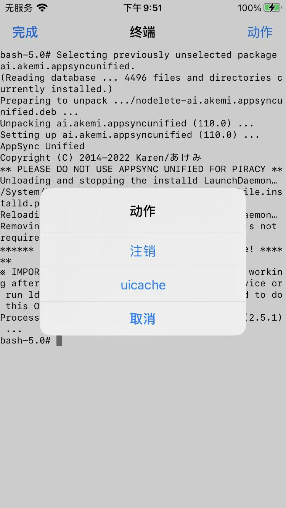
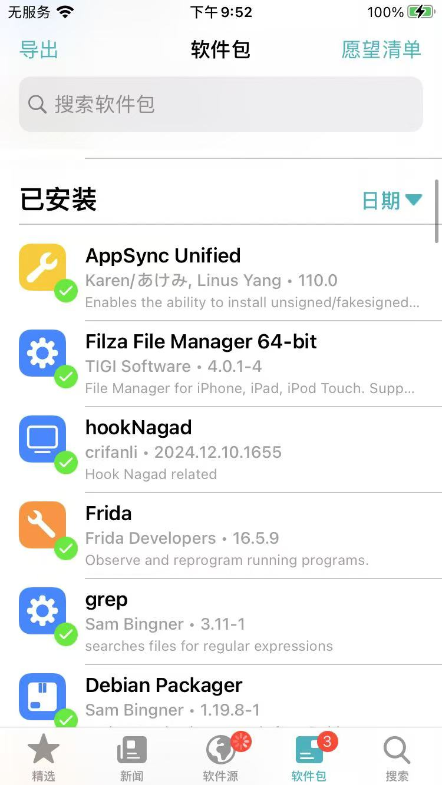
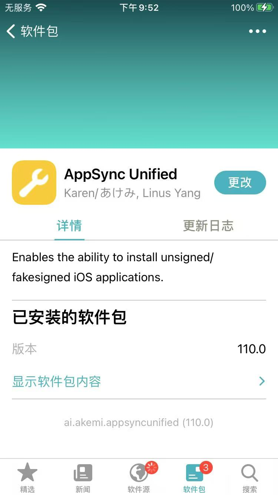
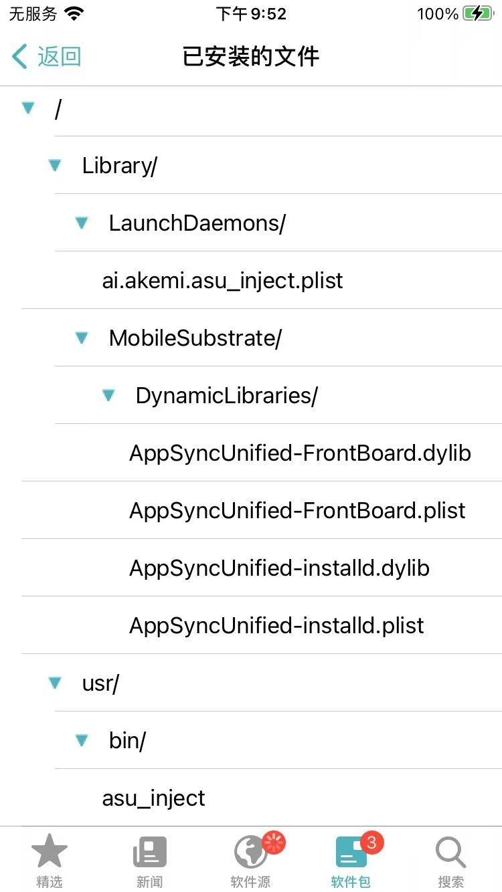

# Filza安装

此处介绍，从Filza中的deb插件去安装`AppSync Unified`：

* 点击`deb插件`
  * 
* 点击右上角的`安装`
  * 
* 点击右上角的`动作`
  * 
* 点击`注销`=`respring`
  * 
* 重启后，Sileo中能看到：已安装的插件中，有：`AppSync Unified`
  * 
* 进入可以看到详情页
  * 
* 和`已安装的文件`的详情
  * 
