# Cyida中通过TIGI Software软件源安装Filza

去Cydia中添加软件源：

http://tigisoftware.com/cydia/

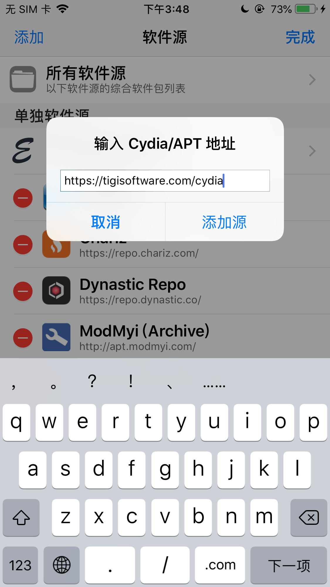

确定后，开始验证URL：

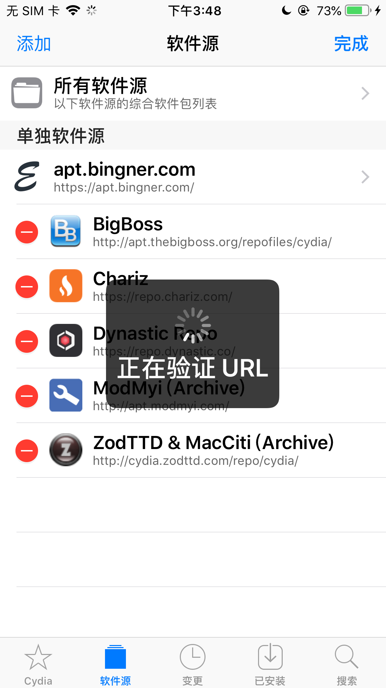

开始更新源：

* 正在更新软件源
  * 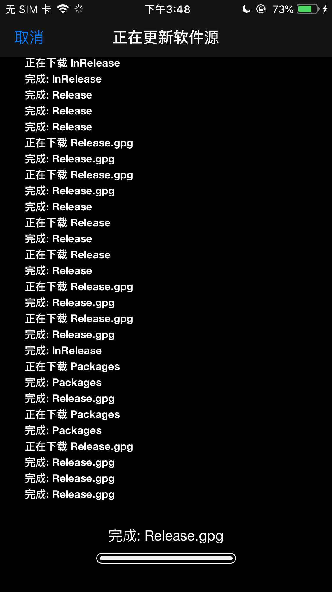
* 重新加载数据
  * 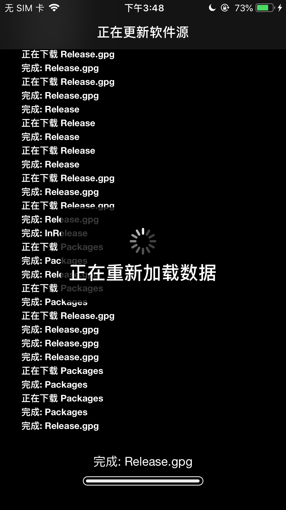
* 完成
  * 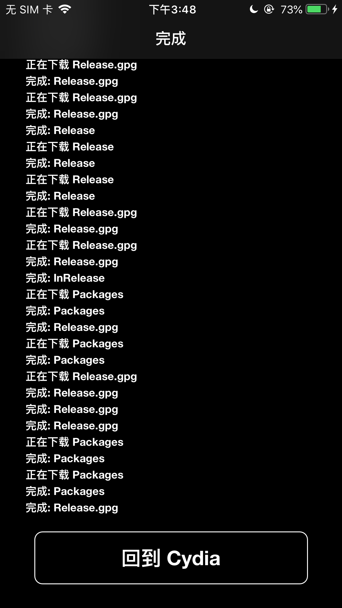

点击回到Cydia，可以看到新增了的源：`TIGI Software`

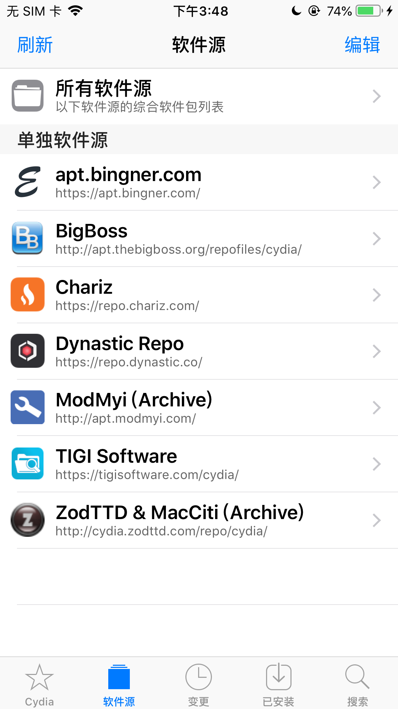

点击进入`TIGI Software`：

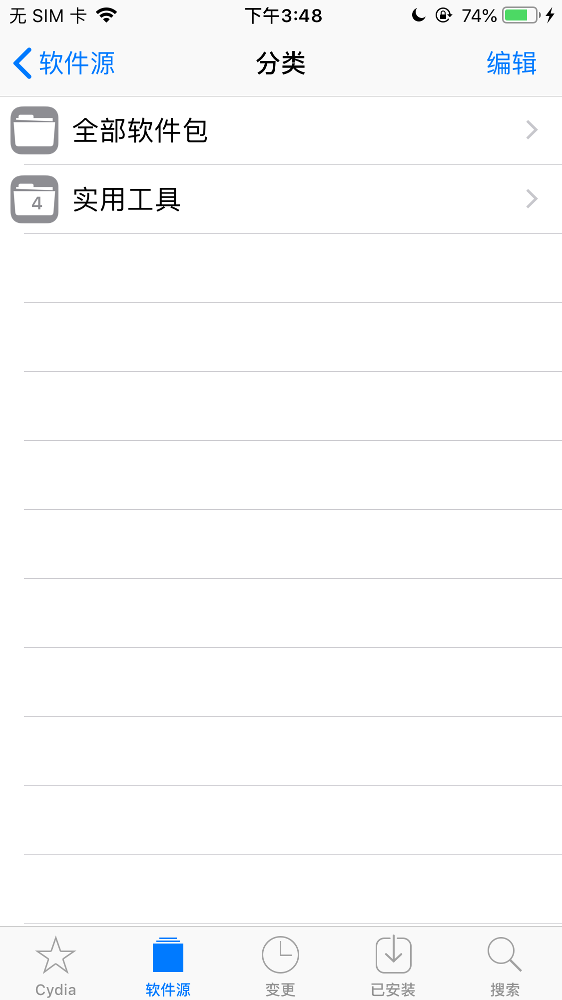

点击`实用工具`：

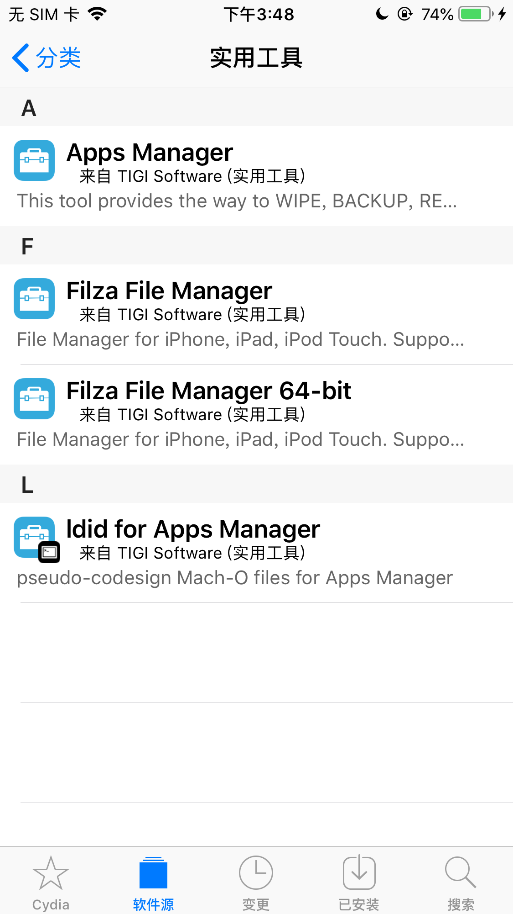

点击其中的，64位的：`Filza File Manager 64-bit`

点击右上角的`安装`：

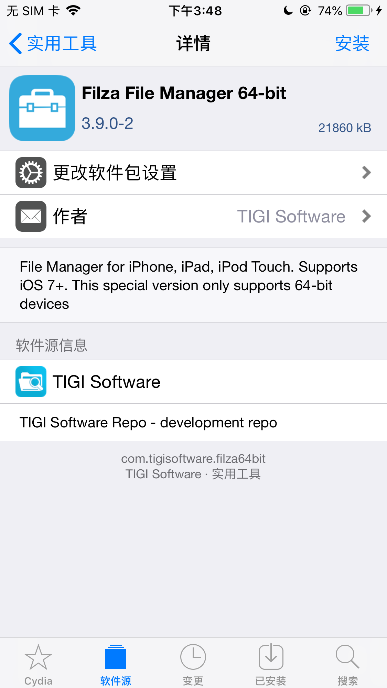

点击`确认`：

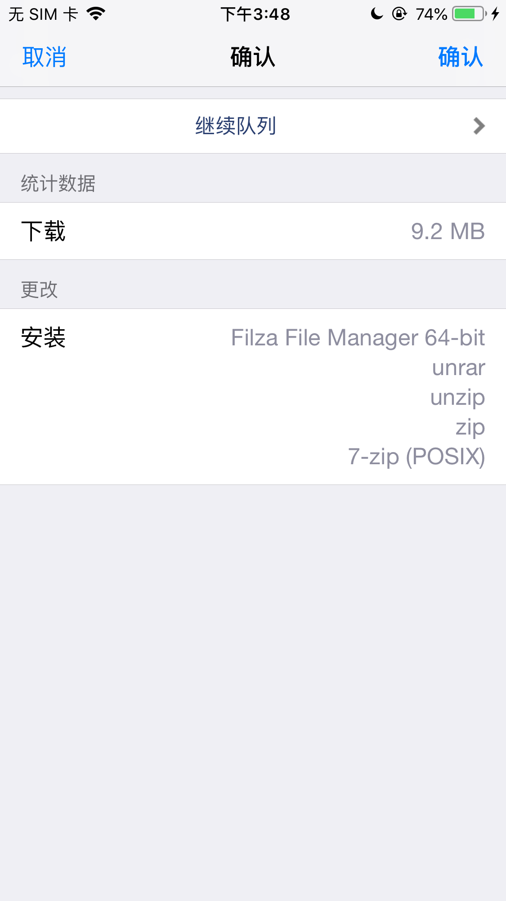

会列出，要安装的插件和其依赖的库：

* `Filza File Manager 64-bit`
* `unrar`
* `unzip`
* `zip`
* `7-zip (POSIX)`

开始安装过程：

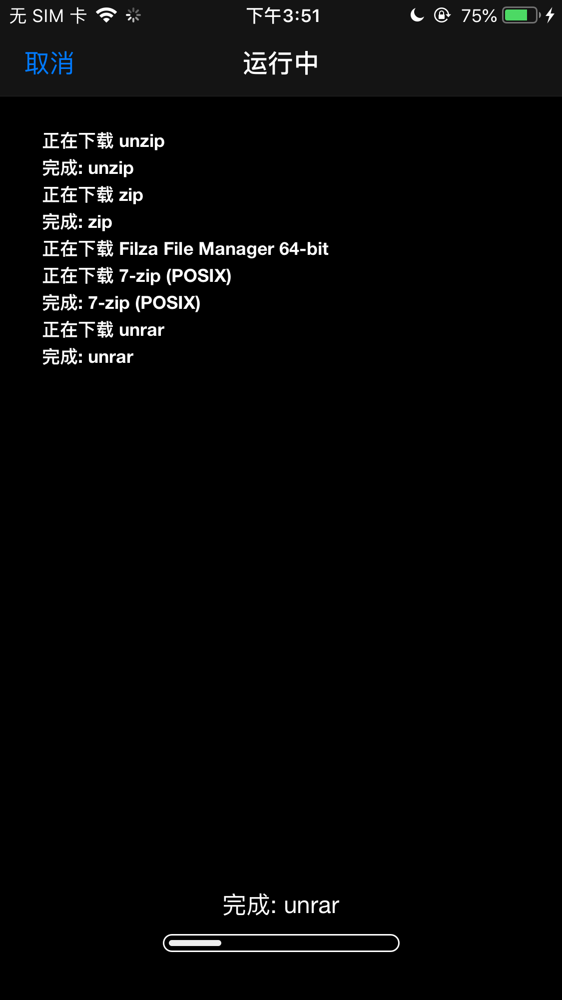

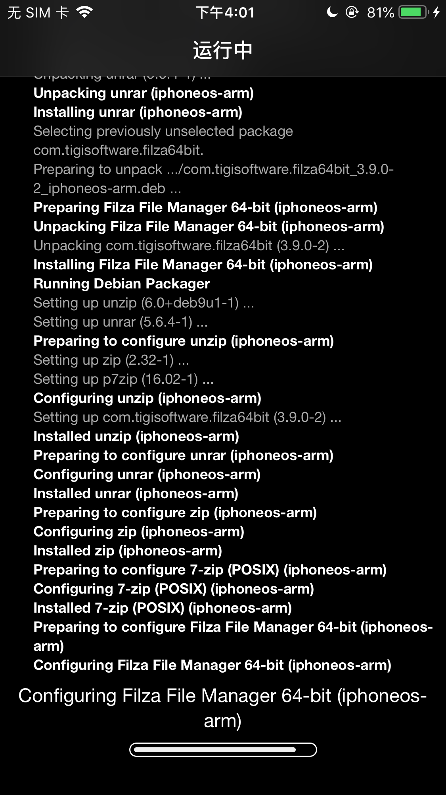

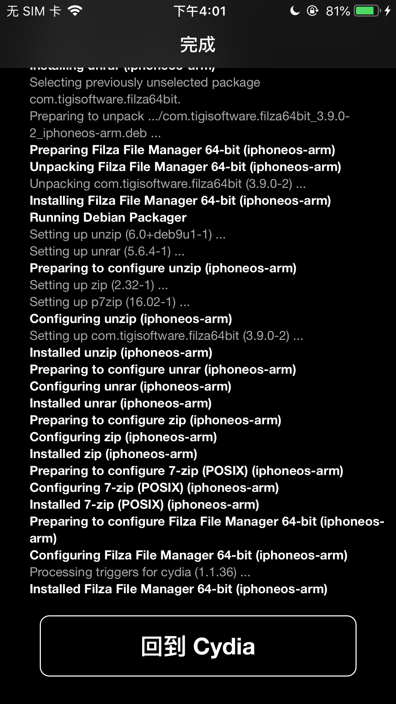

回到Cydia中的`已安装`的`最近`：

可以看到：

* `Filza File Manager 64-bit` - 来自`TIGI Software`（实用工具） 
  * 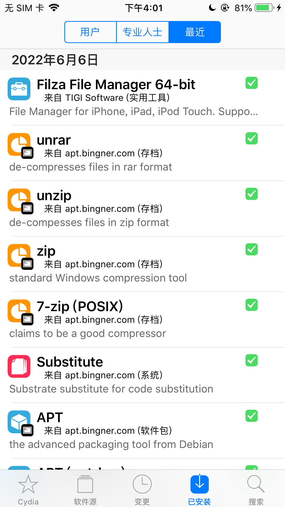

进入详情页面看看：

* `Filza File Manager 64-bit` 版本：`v3.9.0-2`
  * 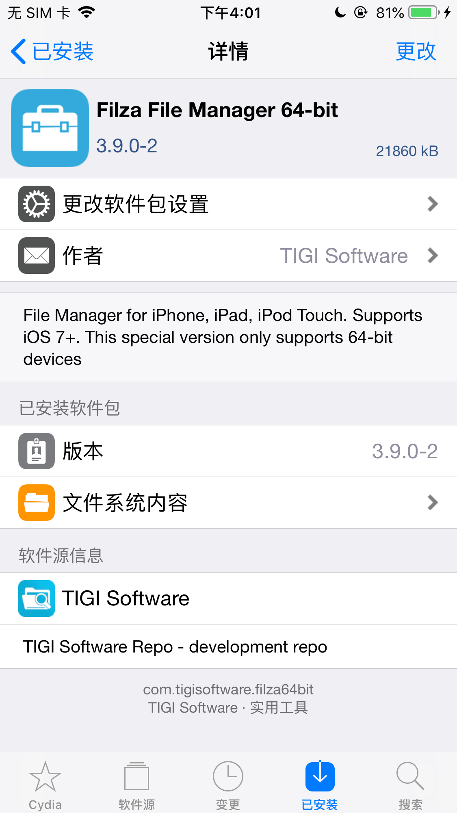

后记：

另外一个版本`4.0.1-3`的效果：

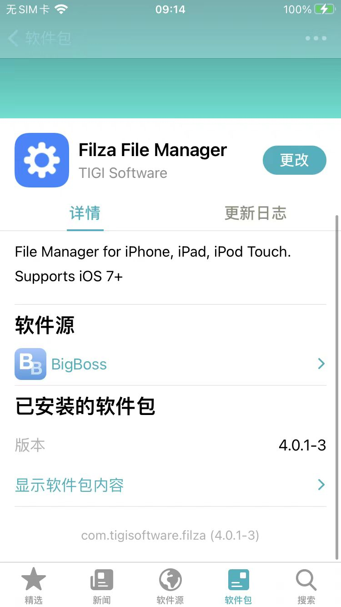

安装后，桌面中出现了Filza的图标：

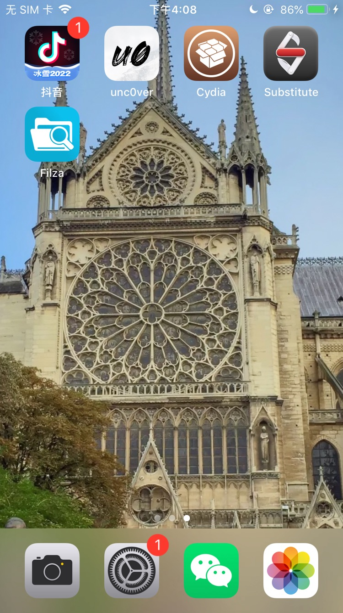

然后点击可以正常进入页面：

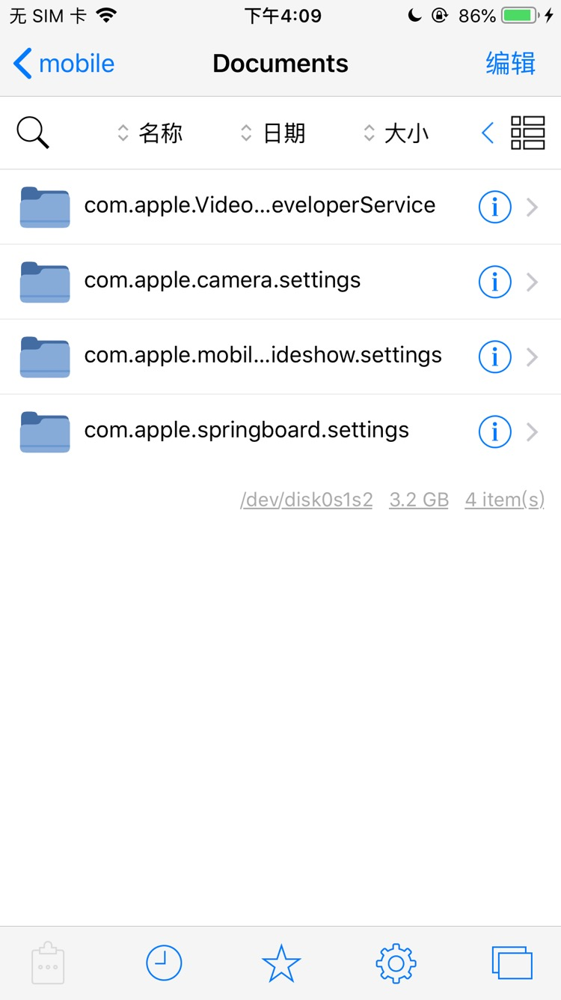
