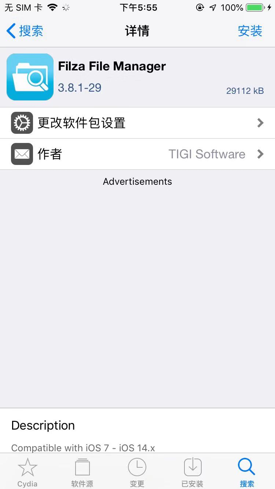
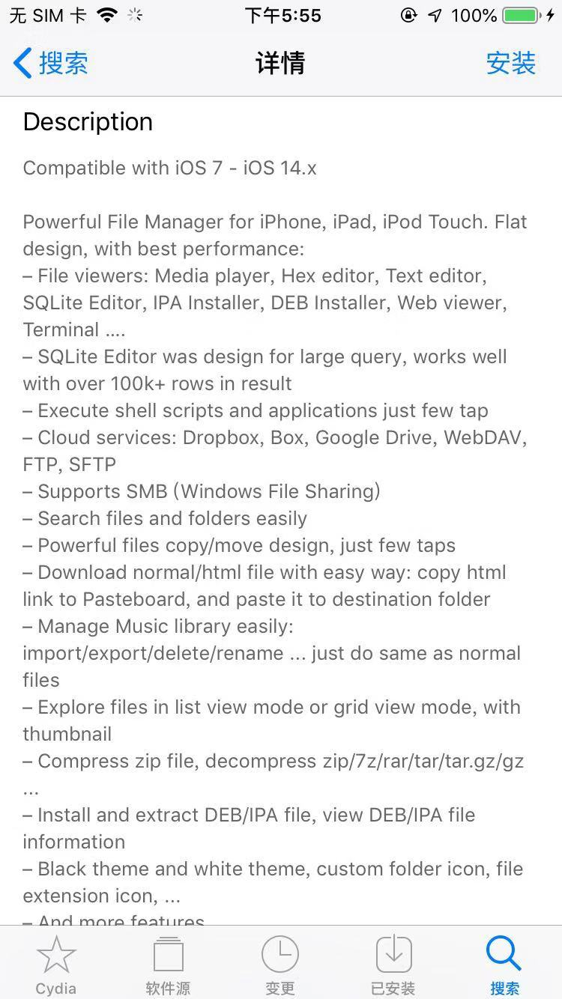
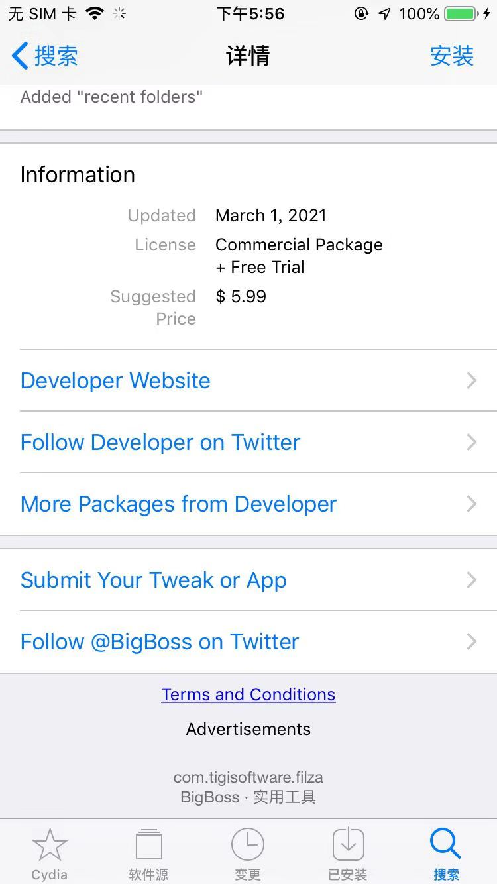
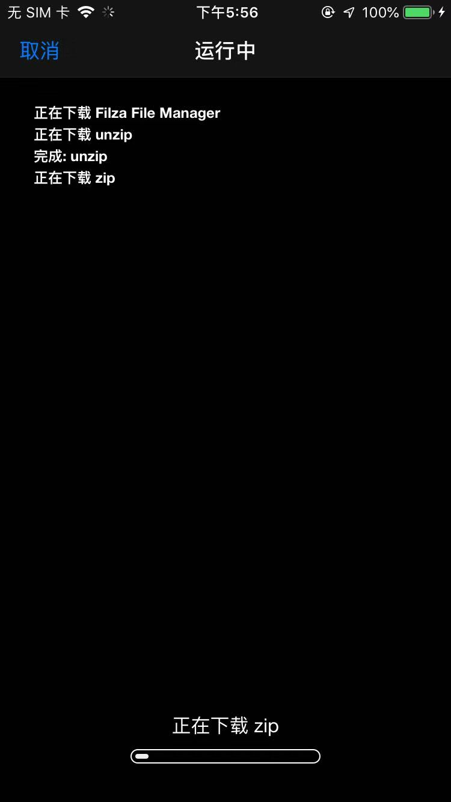
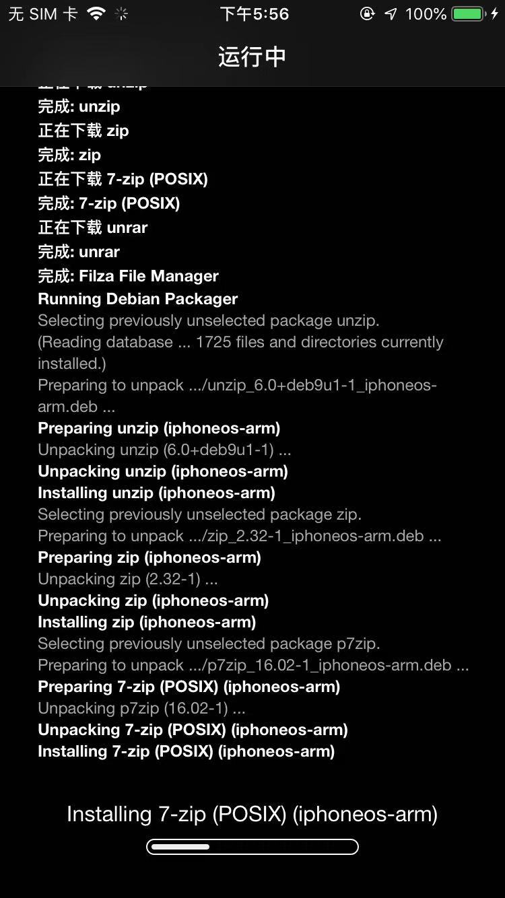
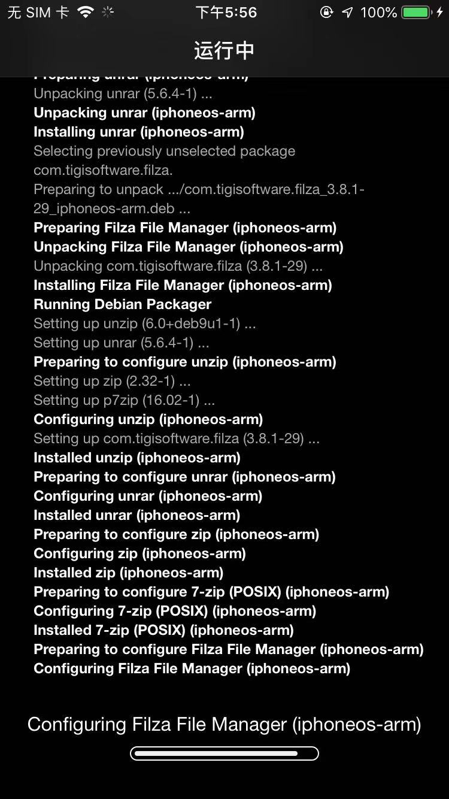
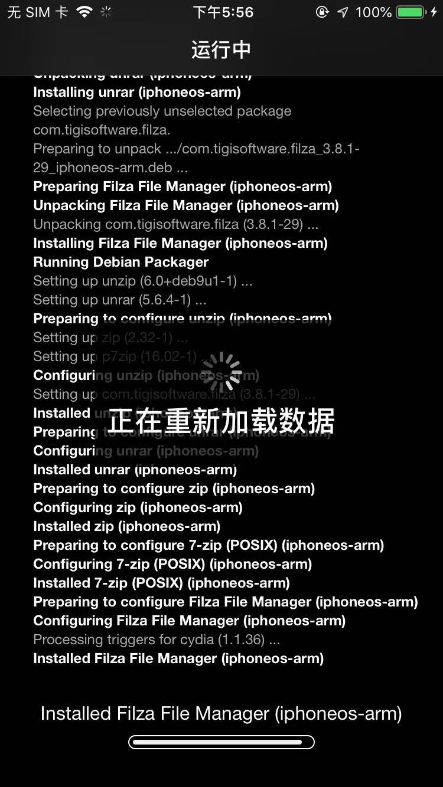
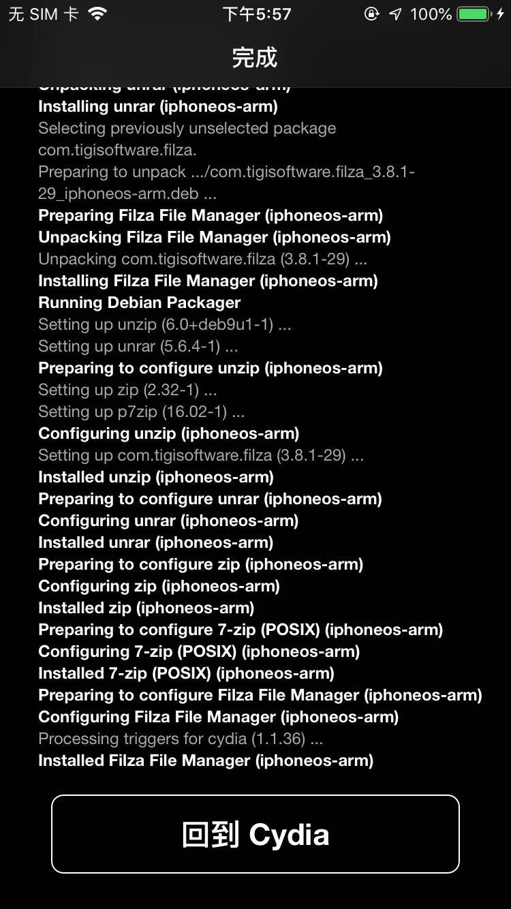
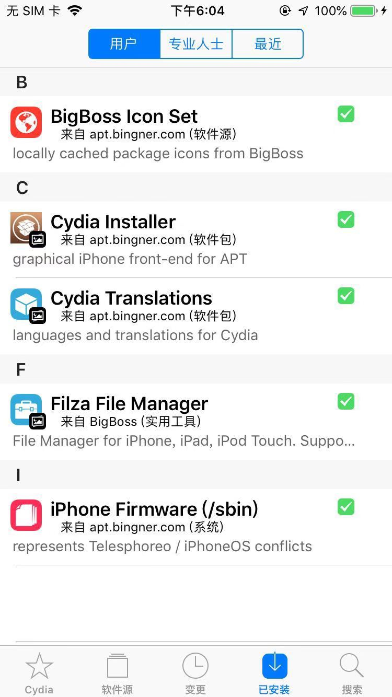

# Cyida中搜索安装Filza `v3.8.1-29`

去Cydia中搜：`Filza`

点击`Filza File Manager`，进入页面：

看看介绍：

点击右上角`安装`，开始安装过程：

* 下载依赖的库，比如`unzip`、`zip`、`7-zip`、`unrar`等
  * 
* 安装依赖的库
  * 
* 配置Filza
  * 
* 重新加载数据
  * 
* 完成，回到Cydia
  * 

点击`回到Cydia`

先返回，回到插件详情页，显示`已安装`的效果：右上角是：`更改`

Cydia中切换到`已安装`，可以看到：

* `Filza File Manager` - 来自 BigBoss 实用工具
  * 

以及桌面上有对应的filza的logo图标了：

