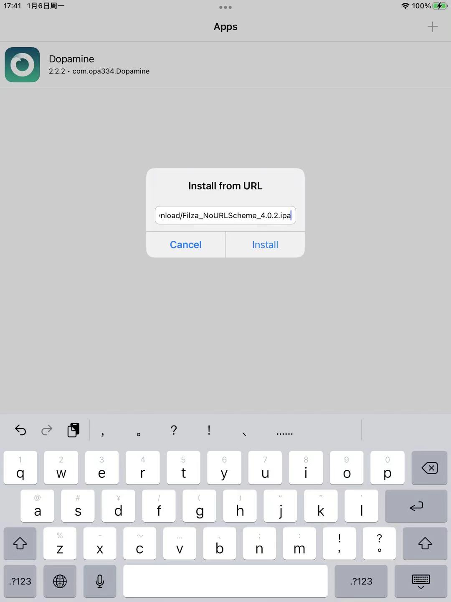
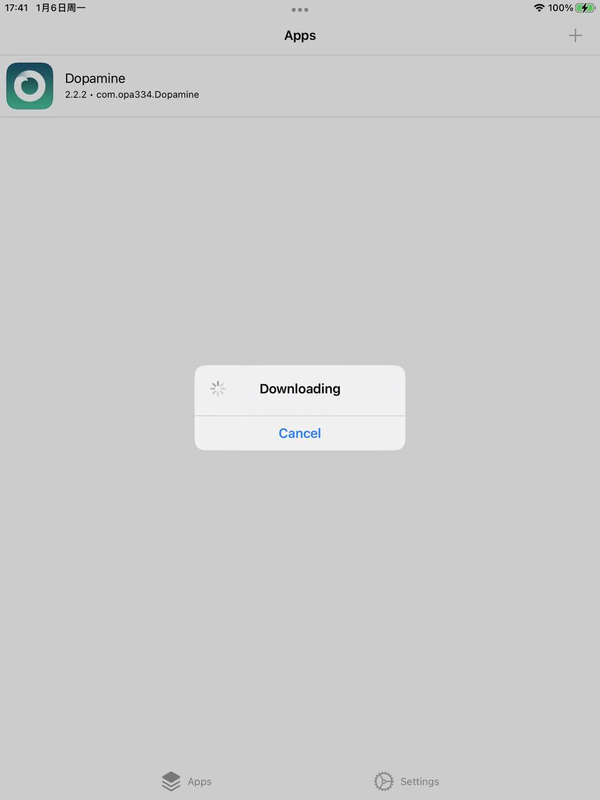
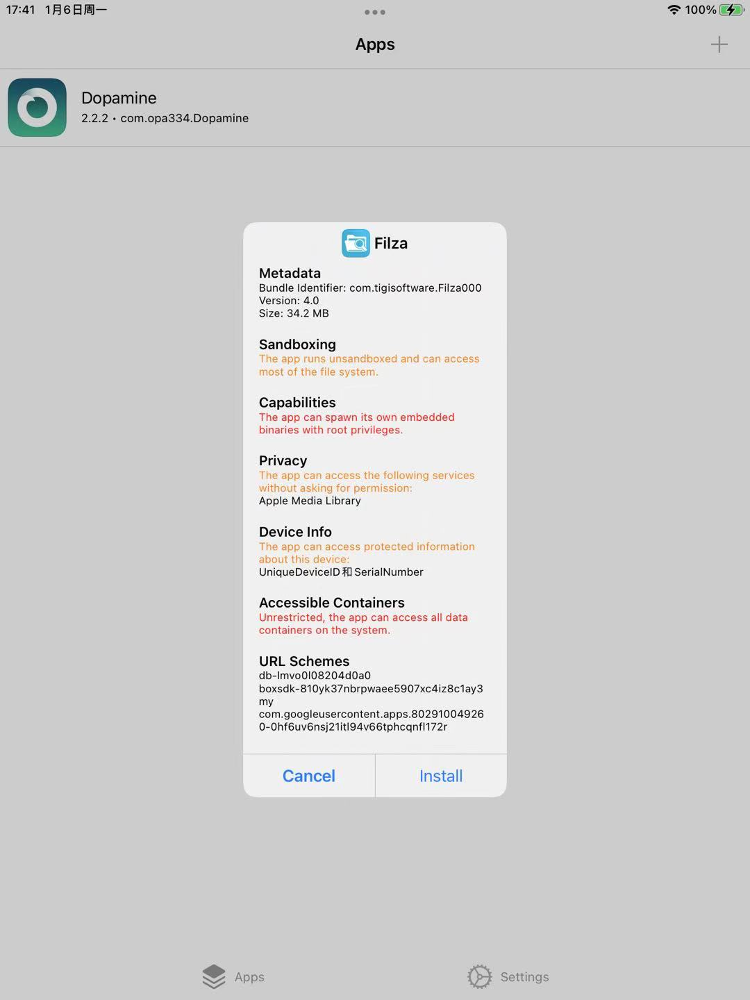
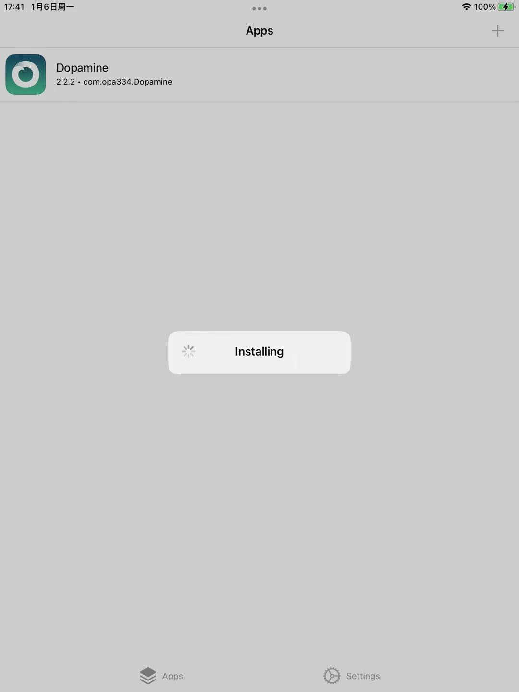
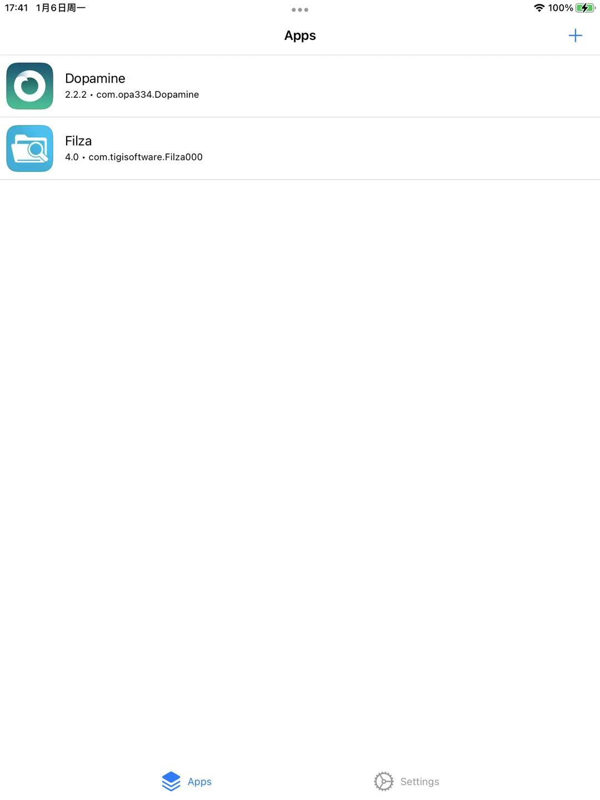
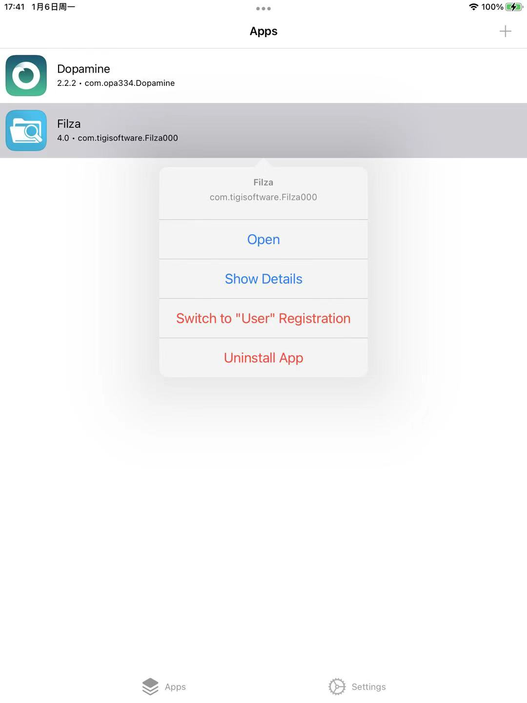
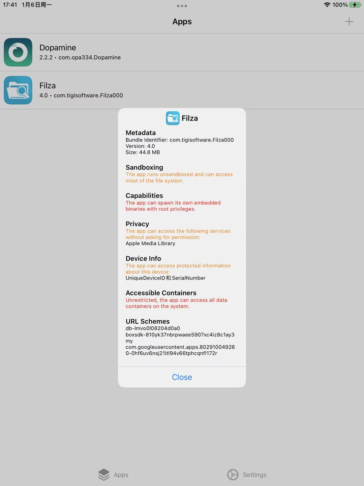
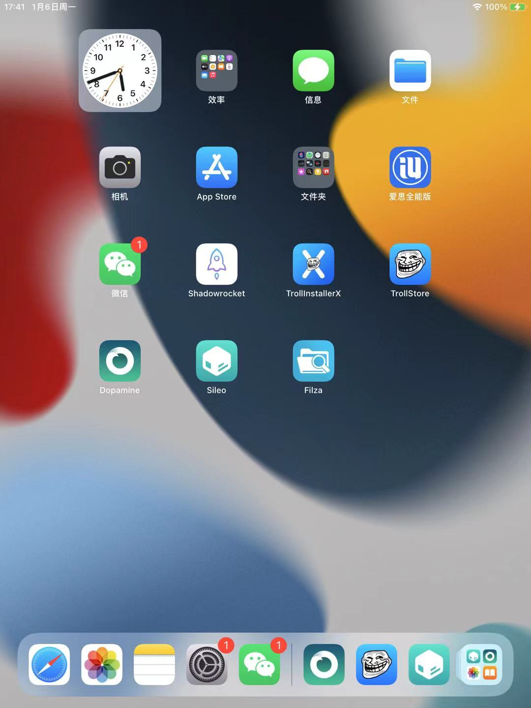

# 用TrollStore安装Filza

## Filza的ipa地址

关于Filza的ipa地址，参考官网：
[Filza File Manager 4.0.0 updated – TIGI Software](https://www.tigisoftware.com/default/?p=439)

而找到了最新版：

* IPA file (v4.0.2) (no url scheme filza://) for TrollStore : Download v4.0.2
  * https://tigisoftware.com/download/Filza_NoURLScheme_4.0.2.ipa

## Trollstore中安装Filza

然后去TrollStore中，点击右上角加号`➕`，出现弹框，输入Filza的ipa地址：

https://tigisoftware.com/download/Filza_NoURLScheme_4.0.2.ipa

点击继续，显示

* Downloading
  * 

下载完毕，弹框提示：

点击`Install`后显示：

* Installing
  * 

安装完毕，Trollstore的列表出现Filza了：

点击，会弹框显示菜单：

点击`Show Details`，显示详情：

另外，此处越狱Pad中，桌面上可以看到Filza的图标了：

表示Trollstore安装Filza完毕。
