# Filza基本页面

安装Filza后，点击桌面图标：`Filza`

打开后效果：

## 显示文件

* `/`
  * 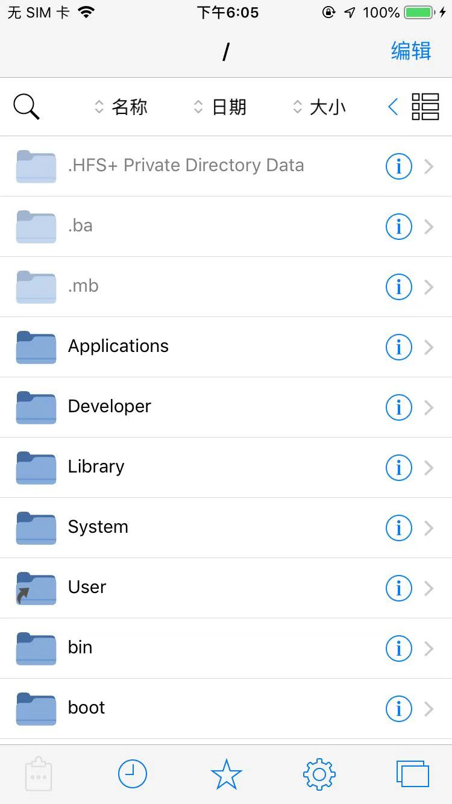
  * 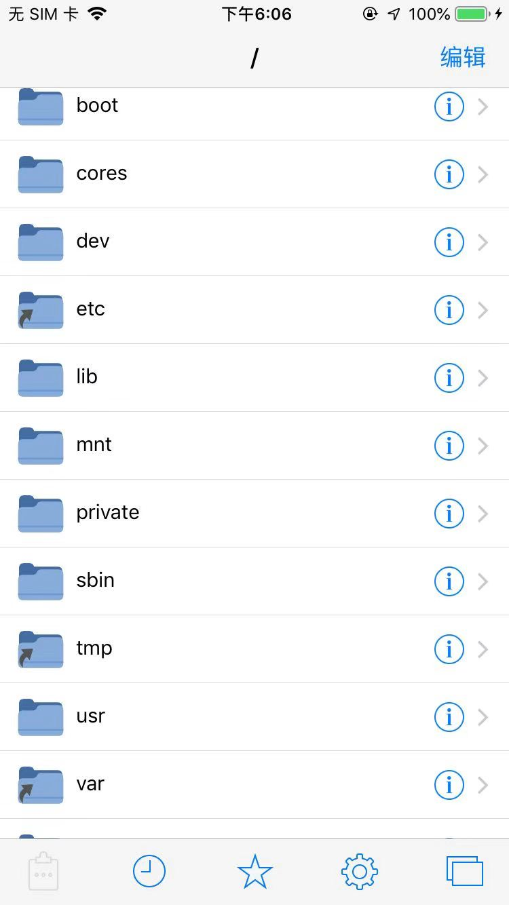
  * 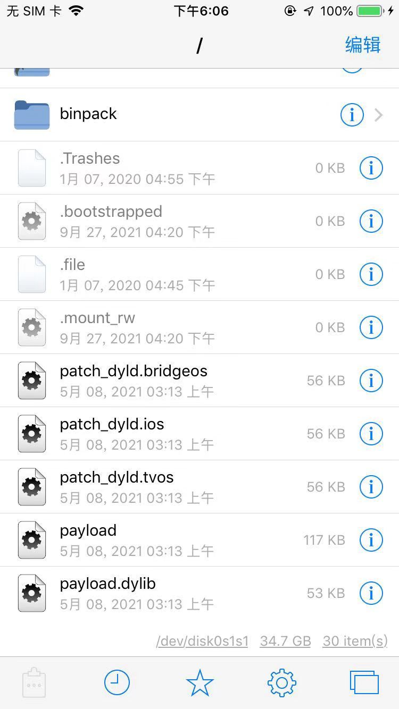
* `/var`
  * 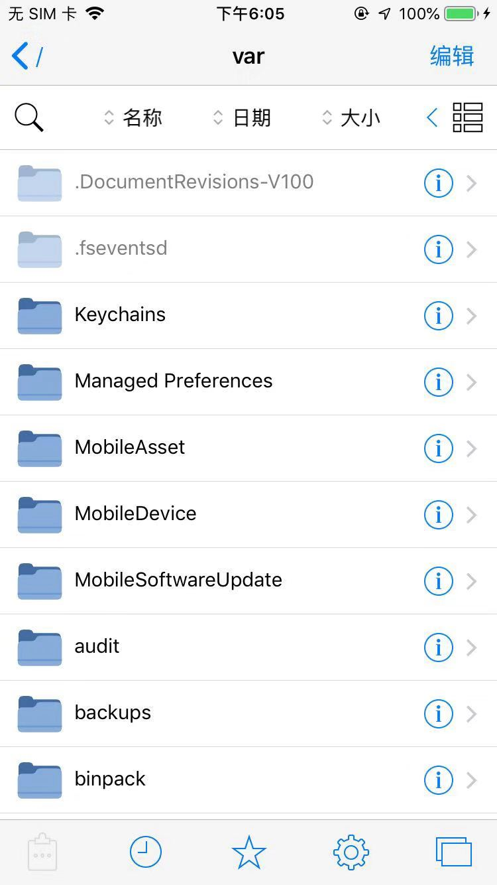
* `/var/mobile`
  * 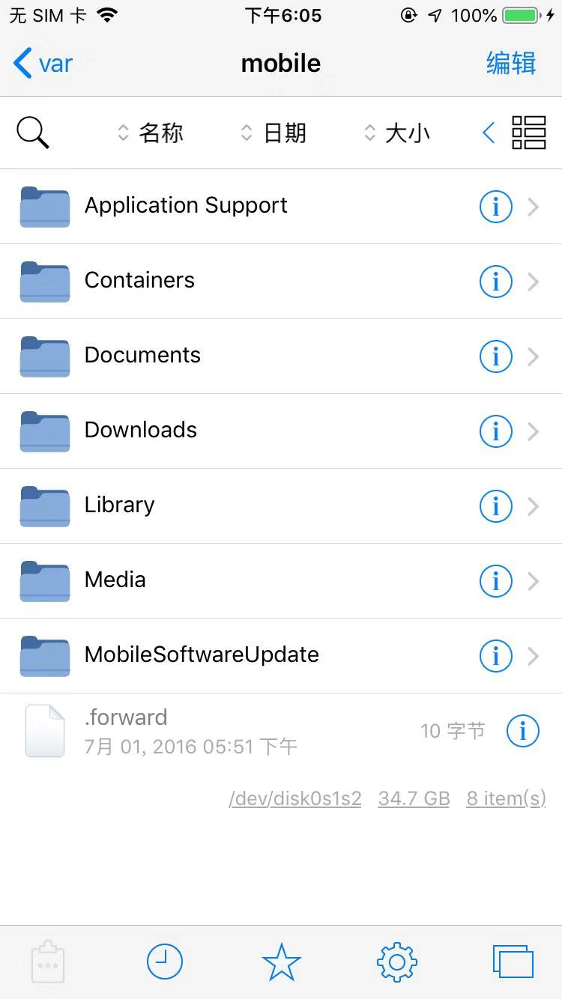
* `/var/Documents`
  * 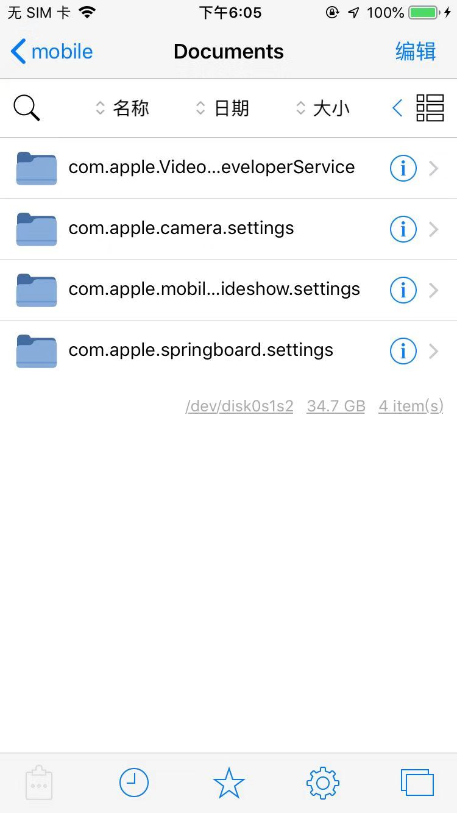

### 某特定文件

* `/bin/su`
  * 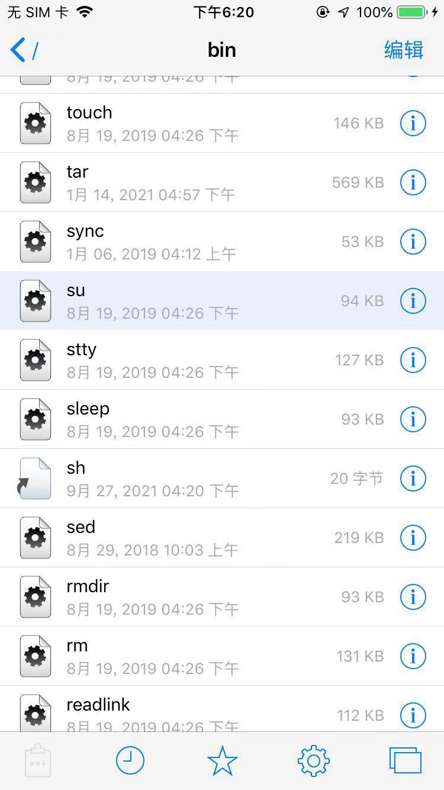

### 正在打开的页面

对于显示文件时：

* 

点击右下角的图标，显示出：

* 正在打开的页面
  * 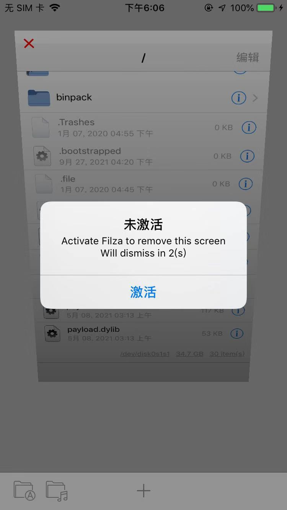

### 关闭页面

点击左上角的`x`，就关闭页面了：

* 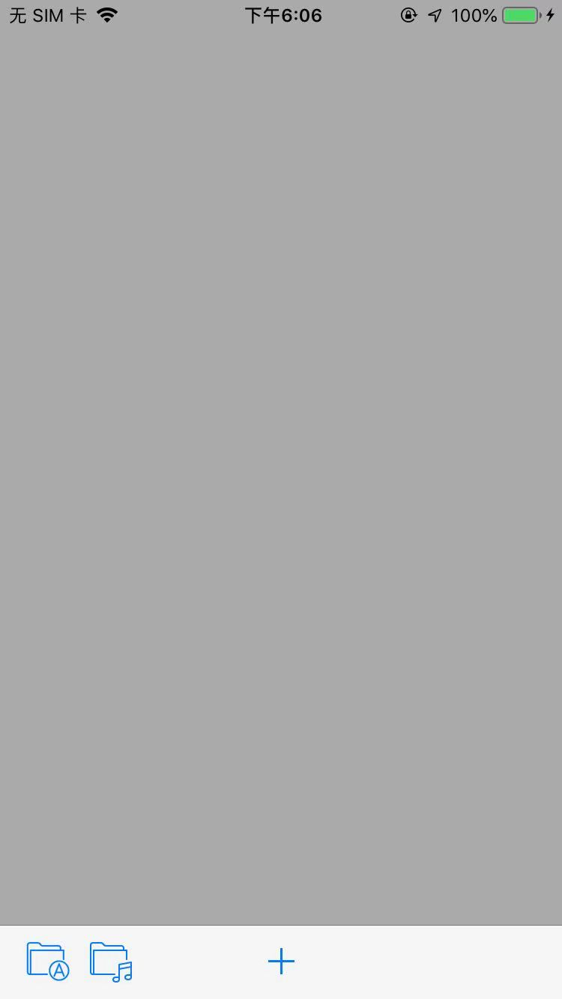

### 新建页面

可以点击 底部中间的 `➕` 加号 去新建窗口。

默认打开的还是 

* `/var/mobile/Documents`

切换显示模式后：

* 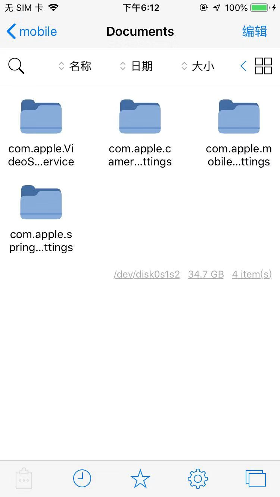

### 搜索

点击搜索，顶部显示出搜索页面：

* 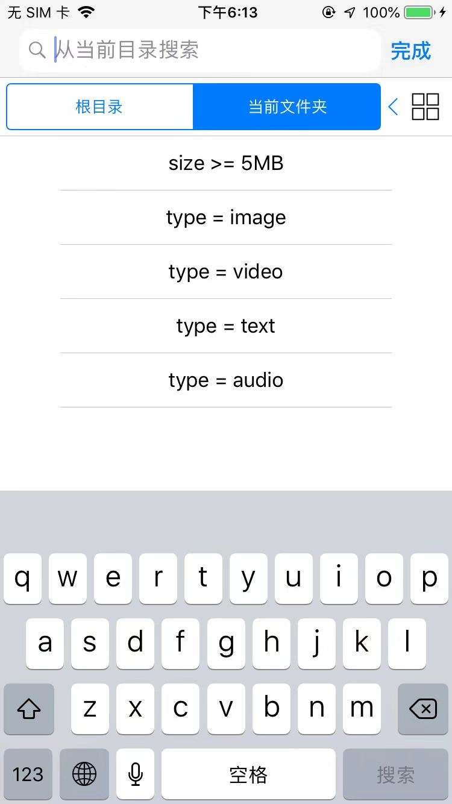

## 设置

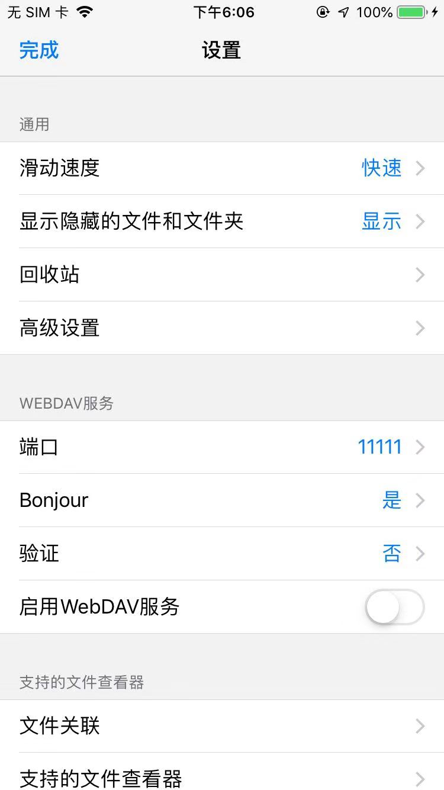

## 收藏夹

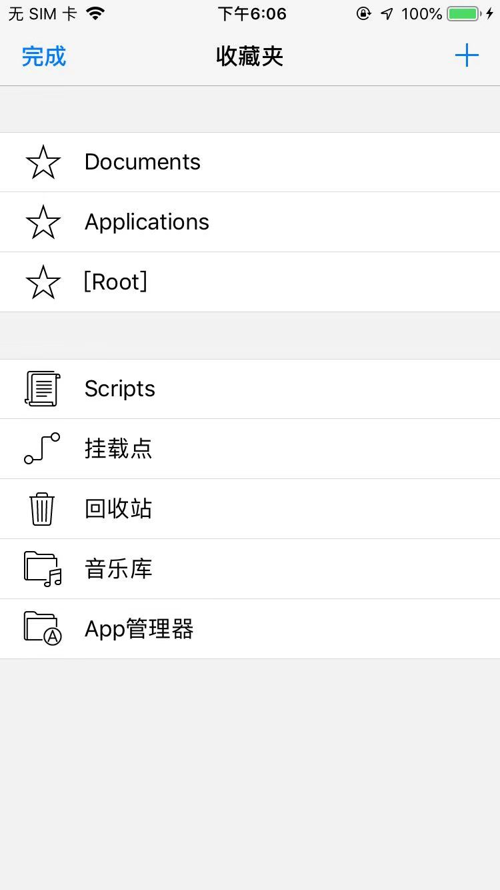
