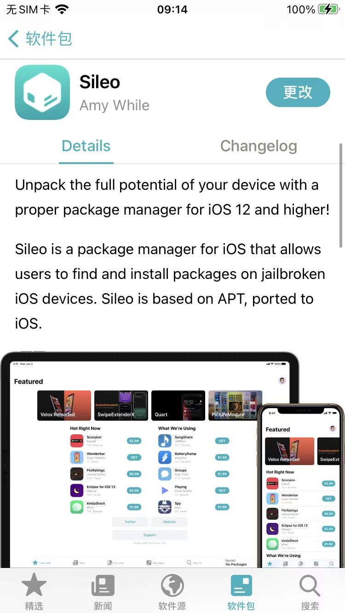

# 初始化逆向开发环境

此处整理和介绍，iOS越狱后，初始化逆向开发环境，常常需要做的事情 = 逆向开发环境初始化 的相关内容

其中：

* 包管理器
  * 说明
    * 即使安装了Cydia，也是可以额外再去安装`Sileo`的
      * 如何安装，详见
        * [Sileo · iOS逆向开发：越狱包管理器](https://book.crifan.org/books/ios_re_package_manager/website/sileo/)
          * 
    * 但是有时候对于旧版越狱系统中，Sileo安装会有问题，此时，就尽量不要安装Sileo了，就继续用Cydia就好

## Tweak插件来源

其他插件地址，绝大多数都可以在这里找到：

* https://www.ios-repo-updates.com
  * [iOS Repo Updates • Cydia iOS Repository Updates for Jailbroken iPhone iPad or iPod (ios-repo-updates.com)](https://www.ios-repo-updates.com/)
