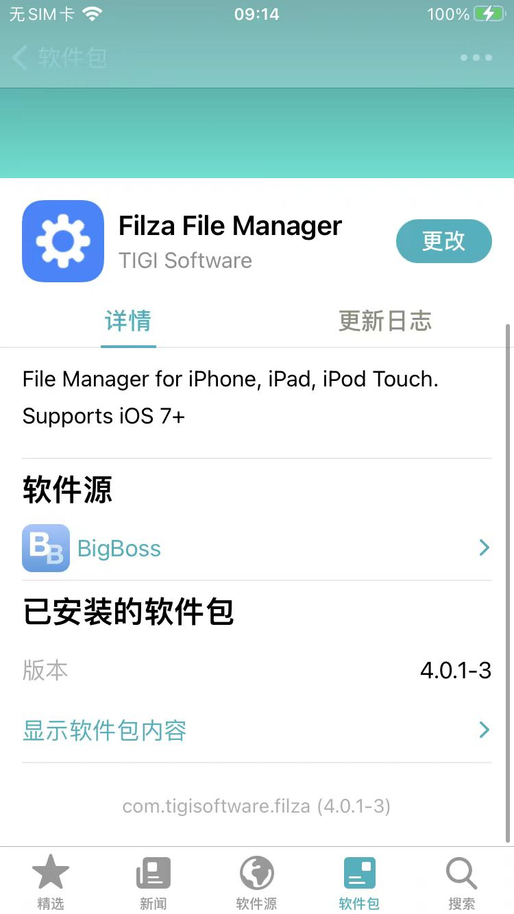

# 初始化逆向开发环境

此处整理和介绍，iOS越狱后，初始化逆向开发环境，常常需要做的事情 = 逆向开发环境初始化 的相关内容

其中主要也就是一些常用插件的安装和设置：

* 包管理器
  * Sileo
    * 源地址：https://repo.getsileo.app
    * 安装后
      * 
* 文件管理器：
  * Filza
    * 源地址：
      * rootful
        * https://tigisoftware.com/repo/
      * rootless 
        * http://apt.thebigboss.org/repofiles/cydia/
    * 安装后
      * 
* ssh = OpenSSH
  * 源地址
    * https://apt.bingner.com/
  * 安装后
    * 
  * 相关内容
    * rootful
      * 默认用户：root
        * 默认密码：alpine
      * 用法举例
        * ssh root@192.168.2.24
    * rootless
      * palera1n越狱后
        * 默认用户：mobile
          * 默认密码：alpine
        * 用法举例：ssh mobile@192.168.2.24
    * 免密登录
      * rootful
        * ssh-copy-id root@192.168.2.24
      * rootless
        * ssh-copy-id mobile@192.168.2.24
* 其他插件
  * AppSync Unified
    * 源地址：https://cydia.akemi.ai/
    * 安装后
      * 
  * ldid = Link Identity Editor
    * 源地址
      * https://apt.bingner.com/
      * https://apt.procurs.us/
    * 安装后
      * 
    * 作用：给ipa伪签名
      * Filza安装ipa之前，有时候需要用到ldid去伪签名
  * AFC2 = Apple File Conduit "2"
    * 源地址
      * rootful
        * http://apt.thebigboss.org/repofiles/cydia
      * rootless
        * 不支持iOS 15+的rootless
    * 安装后
      * 

## Tweak插件来源

其他插件地址，绝大多数都可以在这里找到：

* https://www.ios-repo-updates.com
  * [iOS Repo Updates • Cydia iOS Repository Updates for Jailbroken iPhone iPad or iPod (ios-repo-updates.com)](https://www.ios-repo-updates.com/)
