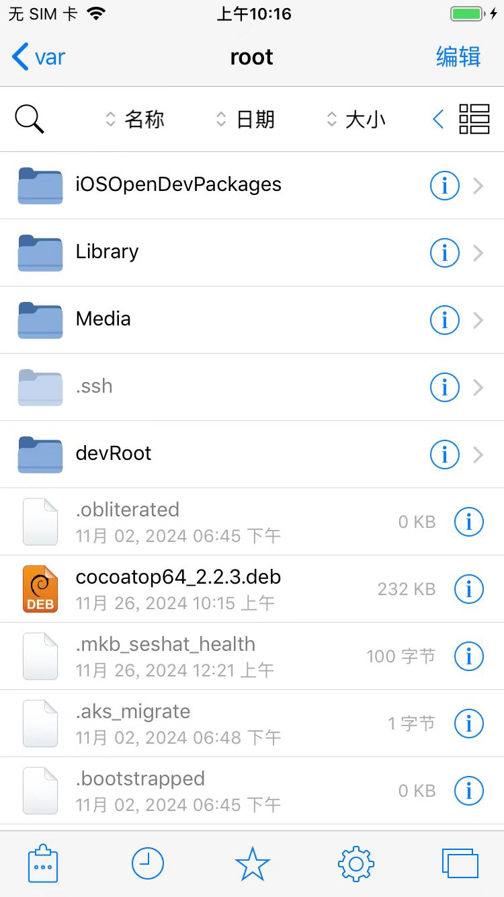

# CocoaTop64

* CocoaTop64：查看进程详情
  * 用途
    * 比如查看进程参数`Raw Process Flags` -》 可以得知进程是否可调试
  * 安装
    * Mac中：下载deb
      * http://apt.thebigboss.org/repofiles/cydia/debs2.0/cocoatop64_2.2.3.deb
        * 注：另外一个，或许可用的，deb地址
          * https://github.com/D0m0/CocoaTop/releases/download/2.2.3/ru.domo.cocoatop64_2.2.3_iphoneos-arm.deb
    * Mac中：下载到iPhone中
      ```bash
      scp cocoatop64_2.2.3.deb root@192.168.2.37:/var/root/
      ```
    * iPhone中：安装deb
      * 2种方式
        * 用Filza安装
          * 点击deb-》安装-》动作-》`注销`=`Respring`=`重启桌面`
        * 用dpkg安装
          ```bash
          dpkg -i cocoatop64_2.2.3.deb
          ```
  * 常见问题
    * 安装后看不到CocoaTop的桌面图标？
      * 去清除UI缓存
        * Filza重新安装一遍deb，最后点击`uicache`
        * 或者自己去ssh命令行中运行：`uicache`

## 安装过程详解

### Filza安装CocoaTop的deb

把下载好的deb，用scp拷贝到iPhone中：

```bash
➜  CocoaTop64 pwd
/Users/crifan/dev/dev_tool/_reverse_security/iOS/TweakPlugin/CocoaTop64
➜  CocoaTop64 ll
total 912
-rw-r--r--@ 1 crifan  staff   227K 11 26 10:14 cocoatop64_2.2.3.deb
-rw-r--r--@ 1 crifan  staff   227K  6  6  2023 ru.domo.cocoatop64_2.2.3_iphoneos-arm.deb
➜  CocoaTop64 scp cocoatop64_2.2.3.deb root@192.168.2.37:/var/root/
cocoatop64_2.2.3.deb                                        100%  227KB   3.1MB/s   00:00
```

然后去Filza中去安装deb：

* 点击deb
  * 
* 点击：安装
  * 
* 点击：动作
  * 
* 点击：`注销`=`Respring`=`重启桌面`
  * 

## 安装后效果

* 桌面图标
  * 
* Cydida中
  * 已安装插件，能看到`CocoaTop64`
    * 
  * CocoaTop插件详情页面
    * 
    * 

## CocoaTop页面

打开后，显示程序列表详情：


点击某个app=程序=进程，可以进入进程详情页：


以及对于某个子项目，尤其是显示内容太长太多，显示不全的，点击后，可以弹框显示详情

比如：

* `Command Line`
  * 
* `Raw Process Flags(Hex)`
  * 
* `Compiler Name`
  * 
