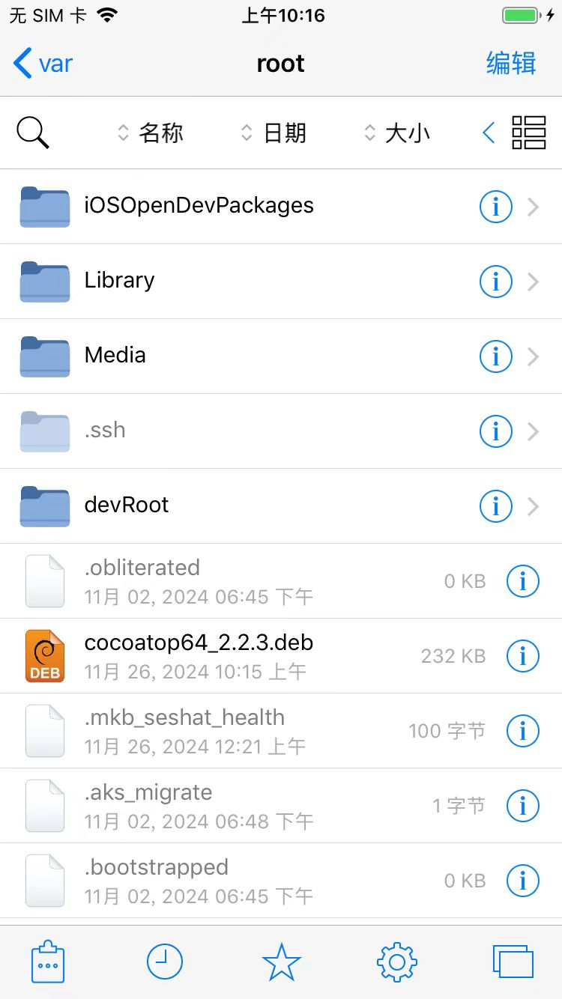
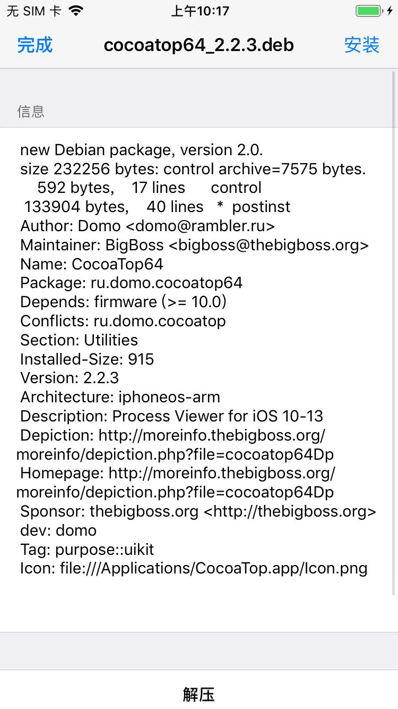
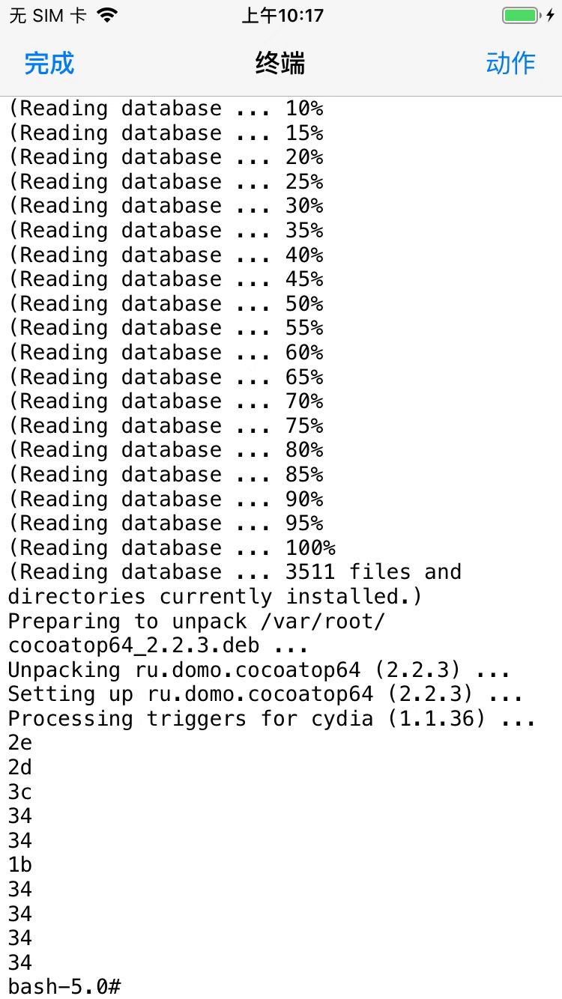
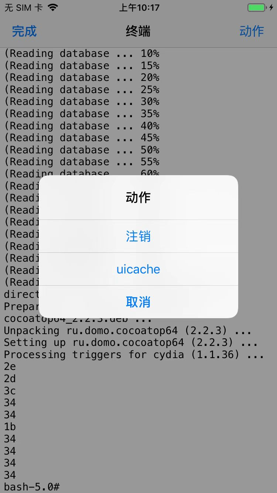

# 安装过程详解

先去下载CocoaTop的deb：

http://apt.thebigboss.org/repofiles/cydia/debs2.0/cocoatop64_2.2.3.deb

## Filza安装CocoaTop的deb

把下载好的deb，用scp拷贝到iPhone中：

```bash
➜  CocoaTop64 pwd
/Users/crifan/dev/dev_tool/_reverse_security/iOS/TweakPlugin/CocoaTop64
➜  CocoaTop64 ll
total 912
-rw-r--r--@ 1 crifan  staff   227K 11 26 10:14 cocoatop64_2.2.3.deb
-rw-r--r--@ 1 crifan  staff   227K  6  6  2023 ru.domo.cocoatop64_2.2.3_iphoneos-arm.deb
➜  CocoaTop64 scp cocoatop64_2.2.3.deb root@192.168.2.37:/var/root/
cocoatop64_2.2.3.deb                                        100%  227KB   3.1MB/s   00:00
```

然后去Filza中去安装deb：

* 点击deb
  * 
* 点击：安装
  * 
* 点击：动作
  * 
* 点击：`注销`=`Respring`=`重启桌面`
  * 
