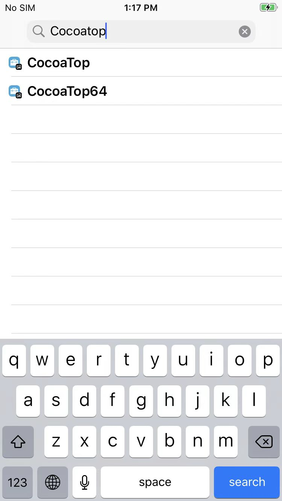
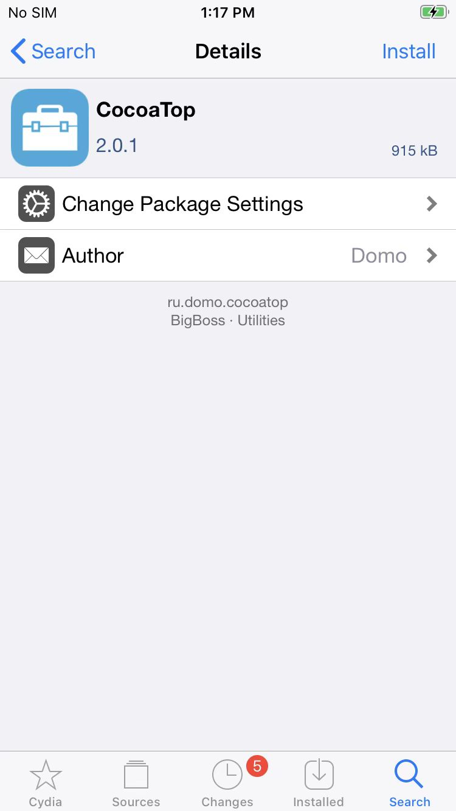
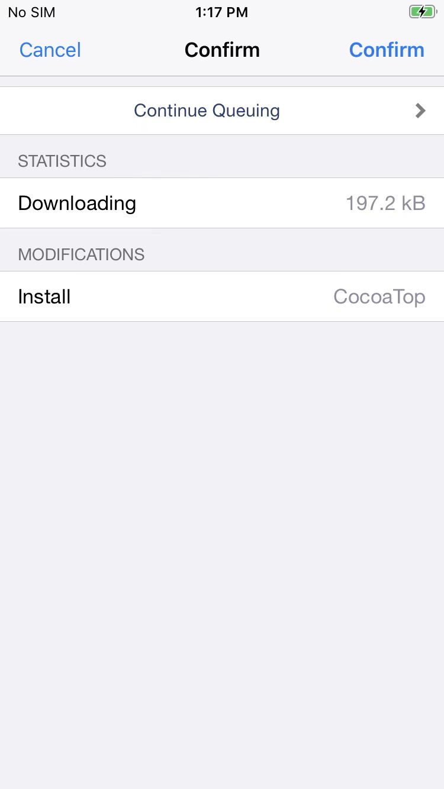
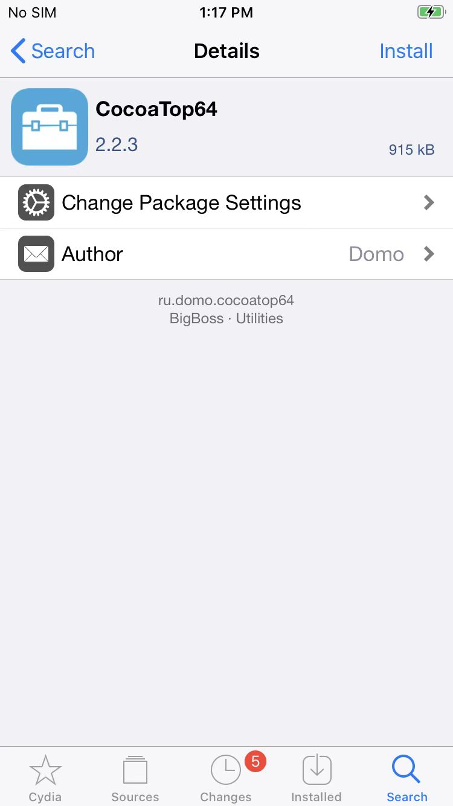
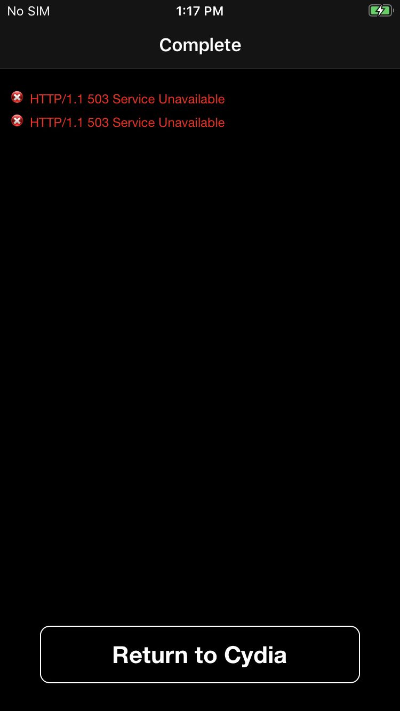

# 注意事项

## 从`Cydia`中从`BigBoss`中搜出来的CocoaTop安装失败

* 从`Cydia`的
  * `BigBoss`的源中搜出来的
    * 
      * `2.0.1`的`CocoaTop`
        * 
        * 
      * `2.2.3`的`CocoaTop64`
        * 
        * 
  * 安装结果会失败
    * HTTP/1.1 503 Service Unavailable
      * 
  * -> 所以后续才改用：直接下载deb，去安装的
