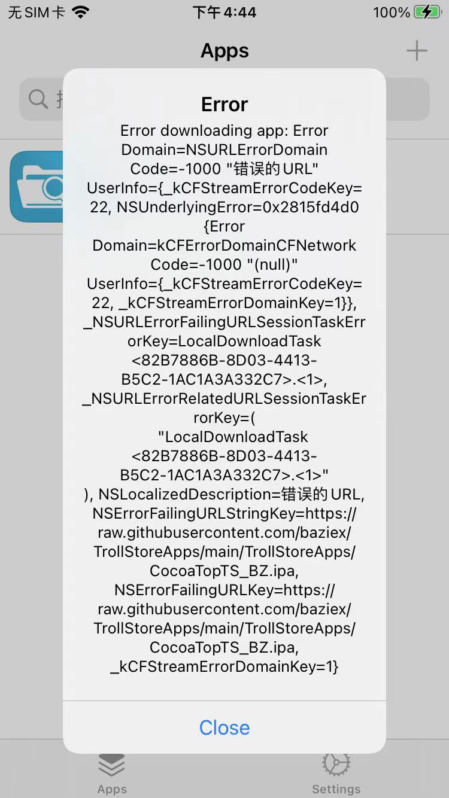
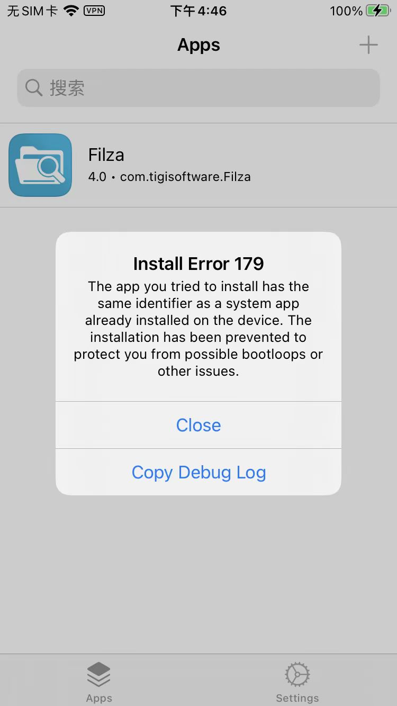

# 常见错误

## 下载报错：Error downloading app NSURLErrorDomain Code -1000

如果下载失败：

Error downloading app NSURLErrorDomain Code -1000



解决办法：

需要翻墙，即：用`小火箭`=`Shadowrocket`去加上代理，即可顺利下载

## 安装报错：Install Error 179

安装期间报错：



```bash
Install Error 179
The app you tried to install has the same identifier as a system app already installed on the device. The installation has been prevented toprotect you from possible bootloops or other issues.
```

拷贝出错误log是：

```bash
2023-06-06 16:46:15.983 trollstorehelper[1580:213444] trollstorehelper invoked with arguments: (
    install,
    custom,
    "/private/var/mobile/Containers/Data/Application/77E3DAB5-089E-4290-A188-DFD31986F1DC/tmp/tmp.ipa"
)
2023-06-06 16:46:16.003 trollstorehelper[1580:213444] [installApp force = 0]
2023-06-06 16:46:16.022 trollstorehelper[1580:213444] trollstorehelper returning 179
```

* 原因：之前安装过，另外一个（异常无法打开的CocoaTop）
* 解决办法：卸载掉之前安装的CocoaTop
* 具体步骤：
  ```bash
  dpkg -r ru.domo.cocoatop64
  ```
  * 注
    * 等价于
      * `dpkg --remove ru.domo.cocoatop64`
