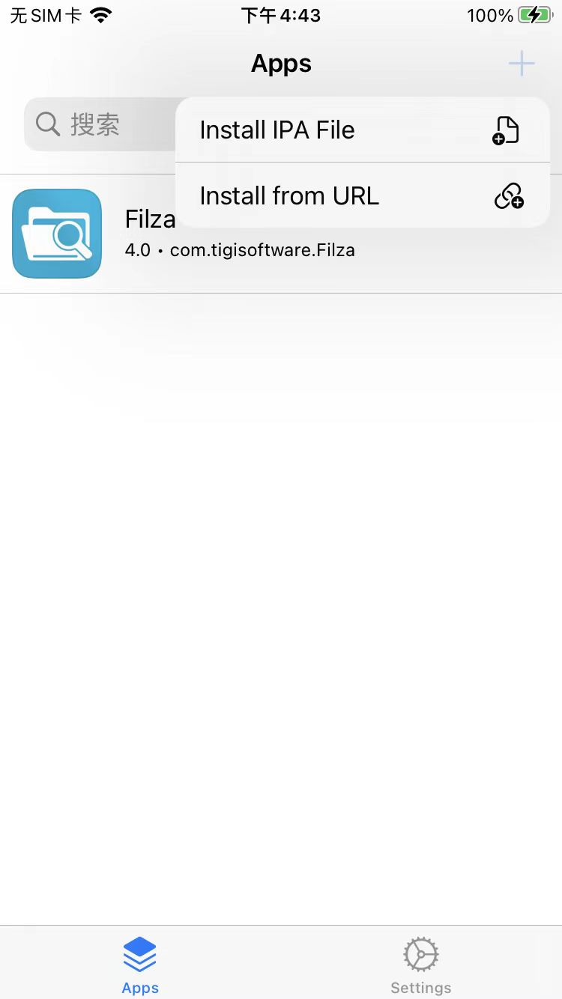
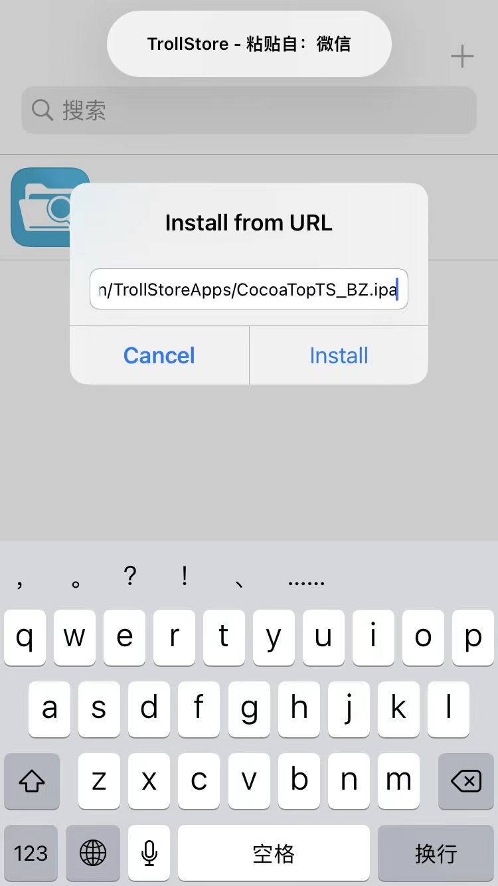
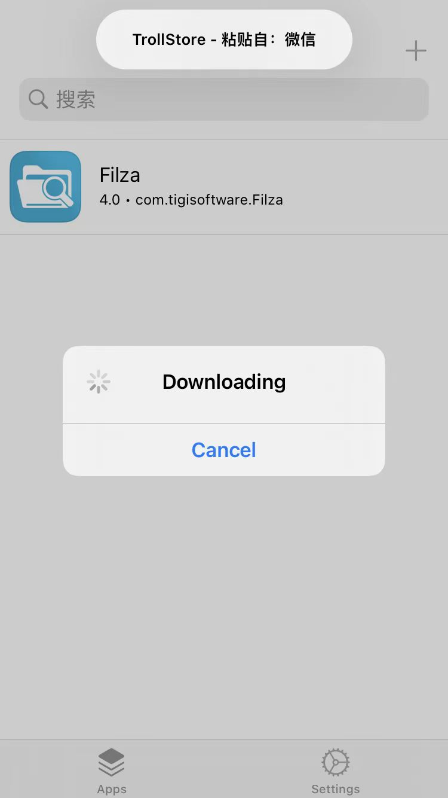
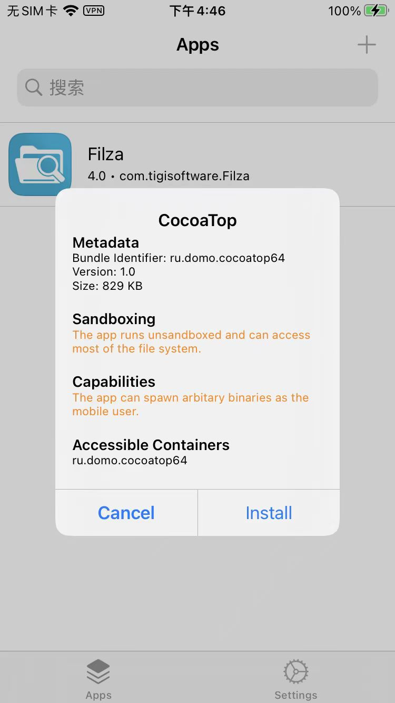
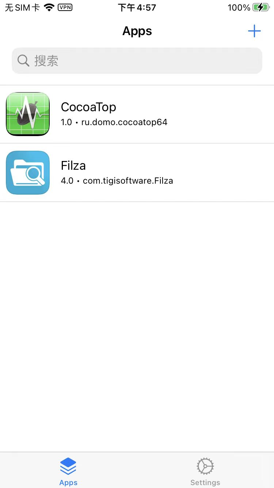
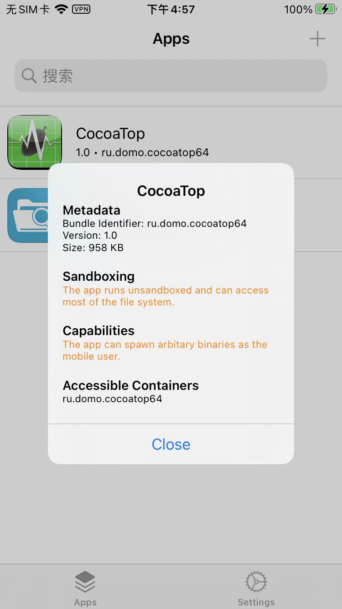
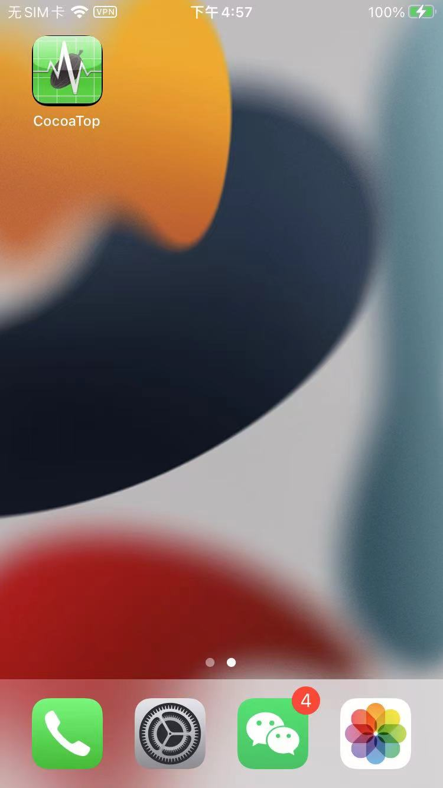

# 安装过程详解

`TrollStore`-》`Install from URL`

粘贴路径：

https://raw.githubusercontent.com/baziex/TrollStoreApps/main/TrollStoreApps/CocoaTopTS_BZ.ipa

进去：

提示Download下载：

将要开始安装了：

* Bundle Identifier: `ru.domo.cocoatop64`

即可安装成功：

点击看看 Detail详情：

即可看到桌面图标：

