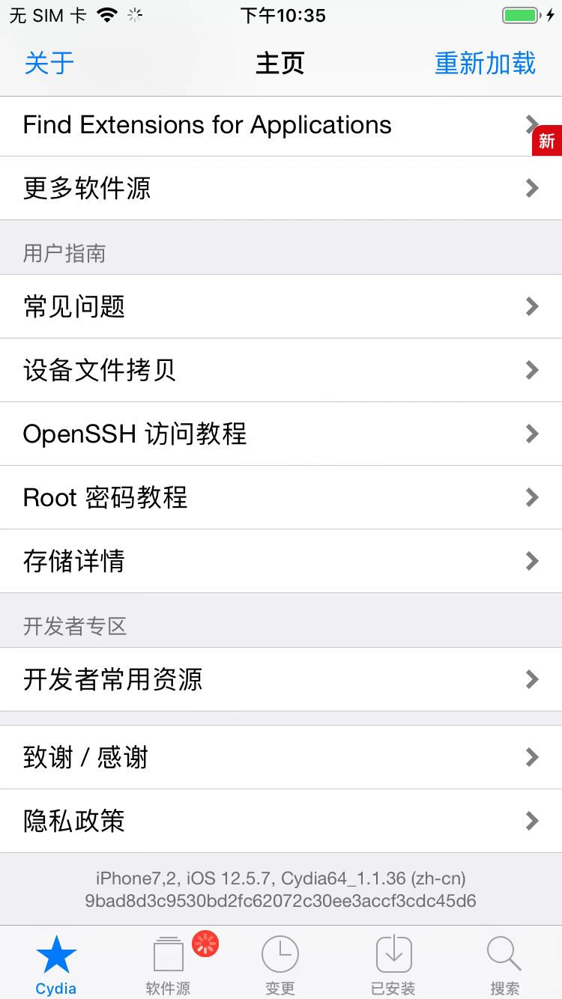

# OpenSSH

* OpenSSH
  * 作用：可以通过`ssh`的命令行方式去访问和操作越狱iPhone
  * 安装
    * `Cydia`/`Sileo`中搜：`openssh`，并安装，即可
      * Cydia
        * 
      * Sileo
        * 
  * 如何使用
    ```bash
    ssh root@192.168.2.28
    ```
    * 说明
      * iPhone要和电脑端（Mac）同处于一个WiFi局域网内
      * `192.168.2.28`是的iPhone的IP
        * 
      * 【首次=只需要初始化一次】
        * 当出现提示`Are you sure you want to continue connecting (yes/no/[fingerprint])? `
          * 输入：`yes`
      * OpenSSH的ssh的（默认）密码是：`alpine`
  * ssh免密登录
    * 概述
      * 初始化好环境后，每次只需要
        ```bash
        ssh-copy-id root@192.168.2.28
        ```

## ssh免密登录

此处详细介绍ssh免密登录的步骤：

注意：这些步骤，都是：首次=只需要初始化一次 == 后续无需重复操作

### 安装工具

先去Mac中安装ssh工具：

* openssh
  ```bash
  brew install openssl
  ```
* ssh-copy-id
  ```bash
  brew install ssh-copy-id
  ```

### 生成证书

再去Mac中生成ssh证书：

```bash
ssh-keygen -t rsa -b 2048
```

其中密码为空，即对于：

```
Enter passphrase (empty for no passphrase):
```

直接回车即可，表示空密码

默认生成的证书是：

* `/Users/crifan/.ssh/id_rsa`
* `/Users/crifan/.ssh/id_rsa.pub`

### 拷贝证书

然后去拷贝ssh证书（`id_rsa.pub`）到iPhone中：

其中iPhone的IP是：`192.168.2.28`

```bash
ssh-copy-id root@192.168.2.28
```

* 输入密码：`alpine`
  * 首次=只需要输入一次
  * 密码是对应的：`OpenSSH`的ssh的**root**账号的密码
    * 注：更深层的说，另外还有个别的用户（比如，不常见的`mobile`用户），还有别的密码

### 免密登录

之后即可ssh免密登录：

```bash
ssh root@192.168.2.28
```

==每次ssh，都不用再输入密码了


## OpenSSH安装后

* 安装后
  * 一般会默认安装5个插件
    * 文字
      * `OpenSSH`
      * `OpenSSH Clients`
      * `OpenSSH Global Listener`
      * `OpenSSH Server Binaries`
      * `OpenSSH 1.1.1 Libraries`
    * 图
      * 
      * 
  * 插件主界面详情页
    * Sileo
      * 
      * 
    * Cydia
      * 
      * 

## 文档

* Cydia中都自带说明文档
  * 
  * 
  * 

## 附录

### ssh-keygen

```bash
➜  iOS_Tweak which ssh-keygen
/usr/bin/ssh-keygen
➜  iOS_Tweak ssh-keygen --version
ssh-keygen: illegal option -- -
usage: ssh-keygen [-q] [-b bits] [-C comment] [-f output_keyfile] [-m format]
                  [-N new_passphrase] [-t dsa | ecdsa | ed25519 | rsa]
       ssh-keygen -p [-f keyfile] [-m format] [-N new_passphrase]
                   [-P old_passphrase]
       ssh-keygen -i [-f input_keyfile] [-m key_format]
       ssh-keygen -e [-f input_keyfile] [-m key_format]
       ssh-keygen -y [-f input_keyfile]
       ssh-keygen -c [-C comment] [-f keyfile] [-P passphrase]
       ssh-keygen -l [-v] [-E fingerprint_hash] [-f input_keyfile]
       ssh-keygen -B [-f input_keyfile]
       ssh-keygen -D pkcs11
       ssh-keygen -F hostname [-lv] [-f known_hosts_file]
       ssh-keygen -H [-f known_hosts_file]
       ssh-keygen -R hostname [-f known_hosts_file]
       ssh-keygen -r hostname [-g] [-f input_keyfile]
       ssh-keygen -G output_file [-v] [-b bits] [-M memory] [-S start_point]
       ssh-keygen -f input_file -T output_file [-v] [-a rounds] [-J num_lines]
                  [-j start_line] [-K checkpt] [-W generator]
       ssh-keygen -I certificate_identity -s ca_key [-hU] [-D pkcs11_provider]
                  [-n principals] [-O option] [-V validity_interval]
                  [-z serial_number] file ...
       ssh-keygen -L [-f input_keyfile]
       ssh-keygen -A [-f prefix_path]
       ssh-keygen -k -f krl_file [-u] [-s ca_public] [-z version_number]
                  file ...
       ssh-keygen -Q -f krl_file file ...
       ssh-keygen -Y check-novalidate -n namespace -s signature_file
       ssh-keygen -Y sign -f key_file -n namespace file ...
       ssh-keygen -Y verify -f allowed_signers_file -I signer_identity
               -n namespace -s signature_file [-r revocation_file]
```

### ssh-copy-id

```bash
➜  iOS_Tweak which ssh-copy-id
/usr/bin/ssh-copy-id
➜  iOS_Tweak ssh-copy-id --version


/usr/bin/ssh-copy-id: ERROR: invalid option (--version)


Usage: /usr/bin/ssh-copy-id [-h|-?|-f|-n] [-i [identity_file]] [-p port] [[-o <ssh -o options>] ...] [user@]hostname
    -f: force mode -- copy keys without trying to check if they are already installed
    -n: dry run    -- no keys are actually copied
    -h|-?: print this help
```
