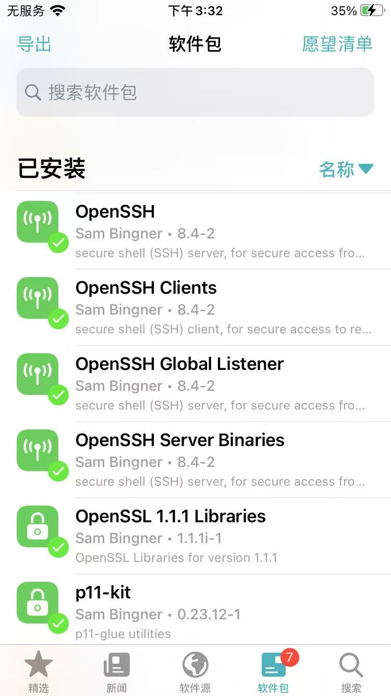
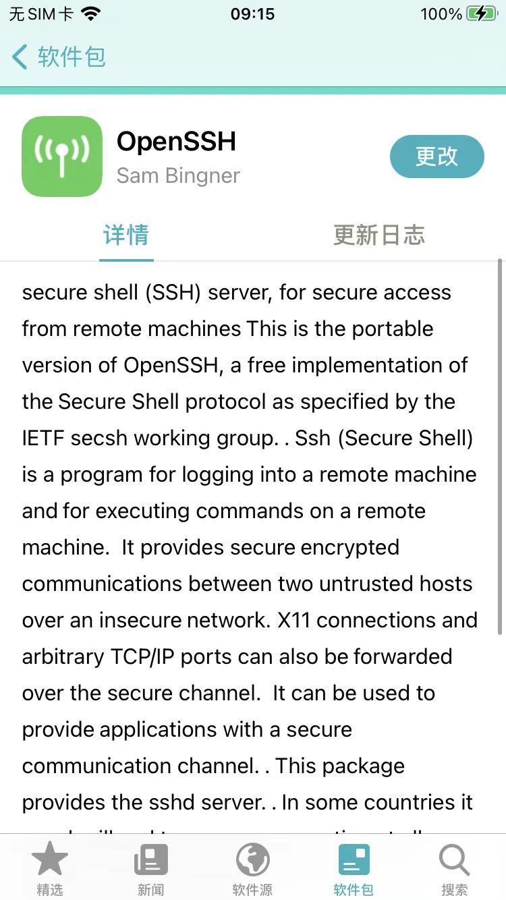
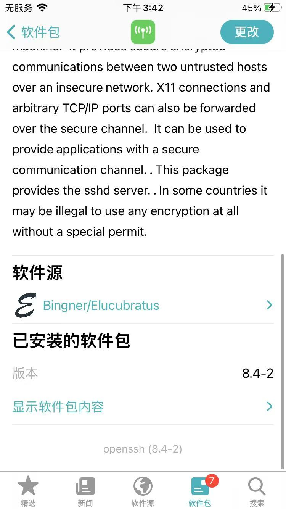

# OpenSSH安装后

* 安装后
  * 一般会默认安装5个插件
    * 文字
      * `OpenSSH`
      * `OpenSSH Clients`
      * `OpenSSH Global Listener`
      * `OpenSSH Server Binaries`
      * `OpenSSH 1.1.1 Libraries`
    * 图
      * 
      * 
  * 插件主界面详情页
    * Sileo
      * 
      * 
      * 
    * Cydia
      * 
      * 