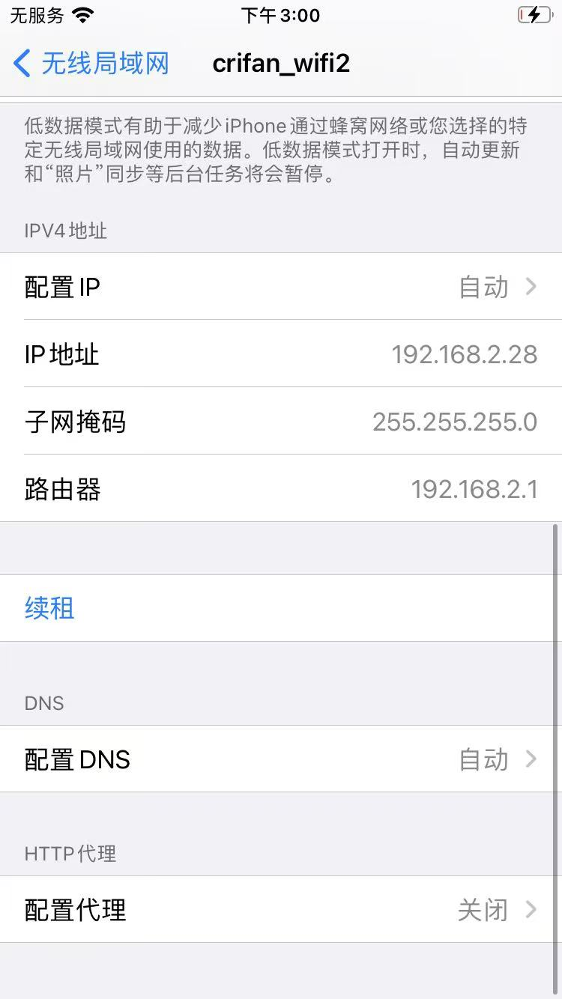

# 登录ssh

## rootful

* ssh登录=如何使用
  ```bash
  ssh root@192.168.2.28
  ```
* 说明
  * iPhone要和电脑端（Mac）同处于一个WiFi局域网内
  * `192.168.2.28`是的iPhone的IP
    * 
  * 【首次=只需要初始化一次】
    * 当出现提示`Are you sure you want to continue connecting (yes/no/[fingerprint])? `
      * 输入：`yes`
  * OpenSSH的ssh的（默认）密码是：`alpine`

## rootless

* 使用方式，同上
  * 唯一需要注意的是：用户名不是`root`，而是`mobile`
  * 所以是
    ```bash
    ssh mobile@192.168.2.28
    ```
