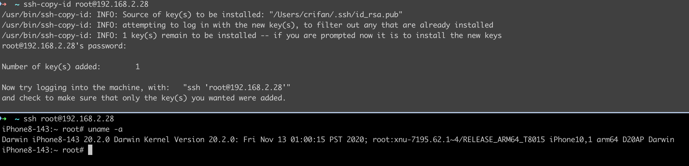

# ssh免密登录

* ssh免密登录
  * 概述
    * 初始化好环境后，每次只需要
      * rootful
        ```bash
        ssh-copy-id root@192.168.2.28
        ```
      * rootless
        ```bash
        ssh-copy-id mobile@192.168.2.28
        ```

---

此处详细介绍ssh免密登录的步骤：

注意：这些步骤，都是：首次=只需要初始化一次 == 后续无需重复操作

## 安装工具

先去Mac中安装ssh工具：

* openssh
  ```bash
  brew install openssl
  ```
* ssh-copy-id
  ```bash
  brew install ssh-copy-id
  ```

## 生成证书

再去Mac中生成ssh证书：

```bash
ssh-keygen -t rsa -b 2048
```

其中密码为空，即对于：

```
Enter passphrase (empty for no passphrase):
```

直接回车即可，表示空密码

默认生成的证书是：

* `/Users/crifan/.ssh/id_rsa`
* `/Users/crifan/.ssh/id_rsa.pub`

## 拷贝证书

然后去拷贝ssh证书（`id_rsa.pub`）到iPhone中：

其中iPhone的IP是：`192.168.2.28`

```bash
ssh-copy-id root@192.168.2.28
```

* 输入密码：`alpine`
  * 首次=只需要输入一次
  * 密码是对应的：`OpenSSH`的ssh的**root**账号的密码
    * 注：更深层的说，另外还有个别的用户（比如，不常见的`mobile`用户），还有别的密码

## 免密登录

之后即可ssh免密登录：

```bash
ssh root@192.168.2.28
```

==每次ssh，都不用再输入密码了


